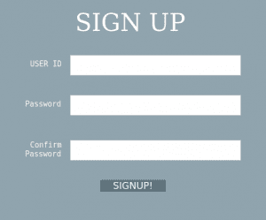
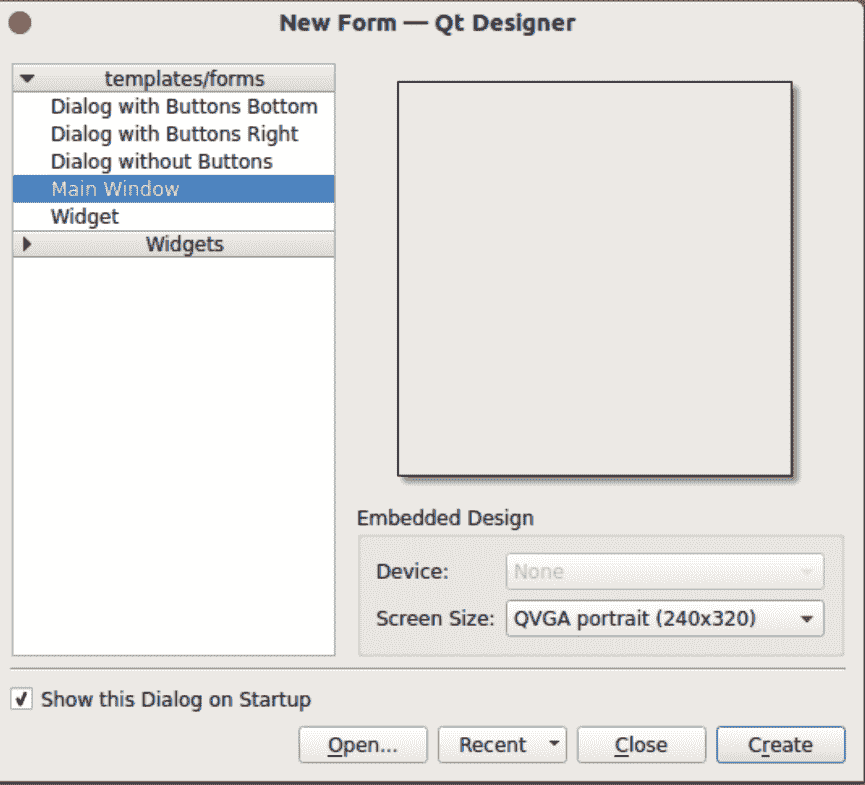
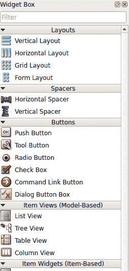
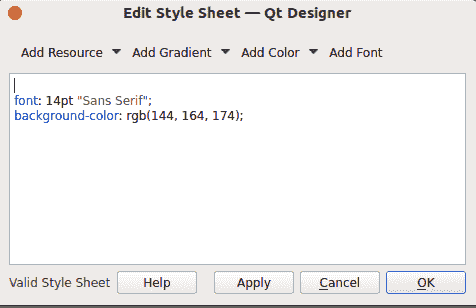

# 使用 Python 中的 PyQt 设计 GUI 应用程序

> 原文:[https://www . geesforgeks . org/python-design-GUI-applications-use-pyqt/](https://www.geeksforgeeks.org/python-designing-gui-applications-using-pyqt/)

使用 **PYQT 设计器工具**构建图形用户界面应用程序相对来说比编写小部件代码耗时更少。这是创建图形用户界面最快最简单的方法之一。

正常的方法是为小部件和功能编写代码。但是使用 Qt-designer，人们可以简单地拖放小部件，这在开发大规模应用程序时非常有用。

**pyqt 5 的安装:**

*   对于 Linux:

```
 sudo apt-get install python3-pyqt5
```

*   对于窗口:

```
 pip install pyqt5
 pip install pyqt5-tools 
```

让我们使用 QT 设计工具创建一个注册表单。创建表单、按钮、文本框等不需要任何代码！这是一个相当拖拉的环境。所以，使用 PyQt 比 Tkinter 简单得多。



QT Designer 将位于 mypython installation dir \ Lib \ site-packages \ pyqt 5-tools，并被命名为 designer.exe(在 Windows 操作系统上)。
打开 Qt 设计器，然后选择**主窗口**，点击**创建**。通过拖动窗口的边缘来设置您喜欢的窗口大小。



**要创建注册表单的布局，需要** **以下小部件:**

1.  三个文本编辑框。
2.  一个按钮。
3.  四个文本标签(签名横幅、用户名标签、密码和确认密码标签)。

你必须在**小部件工具箱**中找到那些小部件。只需将所需的小部件拖放到主窗口或正在运行的窗口上。



要更改窗口或小部件的外观，只需右键单击小部件，然后单击**更改样式表**。



要预览窗口，请按 Ctrl + R。

**保存文件:**
文件将与**一起保存。**扩展 ui。要转换此文件(**)。ui** 扩展名)到一个 Python 文件(**)。py** 扩展)，按照以下步骤操作:

1.  打开终端，导航到布局所在的文件夹。用户界面文件存在。
2.  要转换成 Python 文件，在终端上输入**pyuic 5-x layout . ui-o layout . py**。
3.  使用 python 运行 layout.py！