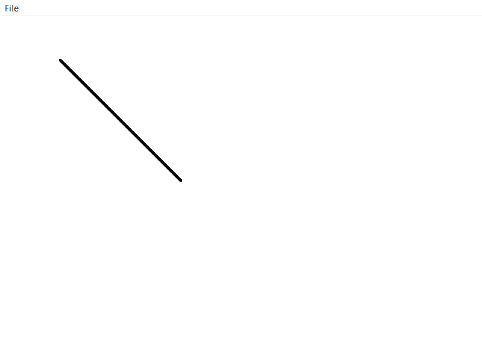
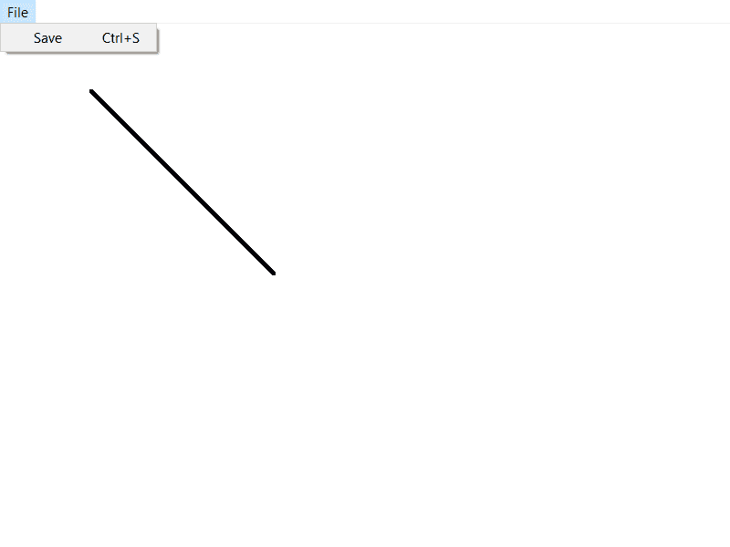
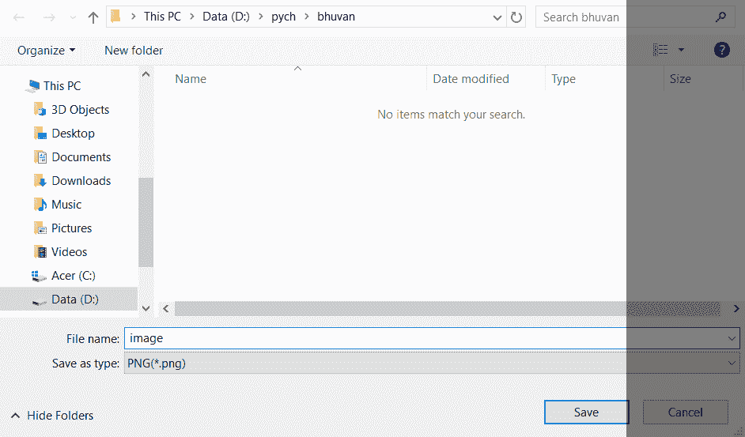

# Python–如何在 pyqt5 中保存画布？

> 原文:[https://www . geeksforgeeks . org/python-如何在 pyqt5 中保存画布/](https://www.geeksforgeeks.org/python-how-to-save-canvas-in-pyqt5/)

Python 提供了这么多开发 GUI 应用程序的选项，PyQt5 就是其中之一。PyQt5 是跨平台的 GUI 工具包，是一组针对 Qt v5 的 python 绑定。由于该库提供的工具和简单性，人们可以非常容易地开发交互式桌面应用程序。

在本教程中，我们将了解如何在 pyqt5 中保存画布。我们使用 **QPainter 类**在画布上绘制东西。

**QPainter :** Qt 的绘画系统能够使用抗锯齿以亚像素精度渲染矢量图形、图像和基于轮廓字体的文本，从而提高渲染质量。

在本文中，我们创建一个画布，并在上面画一条线，看看如何将画布保存为系统上所需位置的图像文件。下面是实现。

## 蟒蛇 3

```
# importing modules
from PyQt5.QtWidgets import *
from PyQt5.QtGui import *
from PyQt5.QtCore import * import sys

# creating class for window
class Window(QMainWindow):
    def __init__(self):
        super().__init__()

        title = "Paint and save Application"

        top = 400
        left = 400
        width = 800
        height = 600

        # setting title of window
        self.setWindowTitle(title)

        # setting geometry
        self.setGeometry(top, left, width, height)

        # creating canvas
        self.image = QImage(self.size(), QImage.Format_RGB32)

        # setting canvas color to white
        self.image.fill(Qt.white)

        # creating menu bar
        mainMenu = self.menuBar()

        # adding file menu in it
        fileMenu = mainMenu.addMenu("File")

        # creating save action
        saveAction = QAction("Save", self)

        # setting save action shortcut
        saveAction.setShortcut("Ctrl + S")

        # adding save action to filemenu
        fileMenu.addAction(saveAction)

        # setting triggered method
        saveAction.triggered.connect(self.save)

        # calling draw_something method
        self.draw_something()

    # paintEvent for creating blank canvas
    def paintEvent(self, event):
        canvasPainter = QPainter(self)
        canvasPainter.drawImage(self.rect(), self.image,
                                      self.image.rect())

    # this method will draw a line
    def draw_something(self):

        painter = QPainter(self.image)

        painter.setPen(QPen(Qt.black, 5, Qt.SolidLine,
                            Qt.RoundCap, Qt.RoundJoin))

        # drawing a line
        painter.drawLine(100, 100, 300, 300)

        # updating it to canvas
        self.update()

    # save method
    def save(self):

        # selecting file path
        filePath, _ = QFileDialog.getSaveFileName(self, "Save Image", "",
                         "PNG(*.png);;JPEG(*.jpg *.jpeg);;All Files(*.*) ")

        # if file path is blank return back
        if filePath == "":
            return

        # saving canvas at desired path
        self.image.save(filePath)

# main method
if __name__ == "__main__":
    app = QApplication(sys.argv)
    window = Window()
    window.show()

    # looping for window
    sys.exit(app.exec())
```

**输出:**
运行完代码后窗口会出现一个白色的画布，上面画着一条线。



点击文件菜单后会出现保存按钮。



当保存按钮被按下时，它将询问位置和名称，并且图像将被保存在期望的位置。



这段代码将以 png 格式将画布保存在所需的位置。