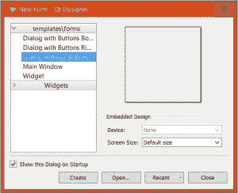
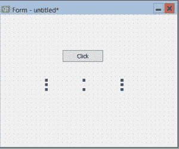
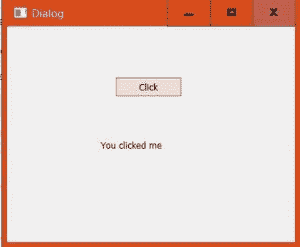

# Python | pyqt 5 简介

> 原文:[https://www.geeksforgeeks.org/python-introduction-to-pyqt5/](https://www.geeksforgeeks.org/python-introduction-to-pyqt5/)

Python 提供了这么多开发 GUI 应用程序的选项，PyQt5 就是其中之一。PyQt5 是跨平台的 GUI 工具包，是一组针对 Qt v5 的 python 绑定。由于该库提供的工具和简单性，人们可以非常容易地开发交互式桌面应用程序。

图形用户界面应用程序由前端和后端组成。PyQt5 提供了一个名为“QtDesigner”的工具，通过拖放的方法来设计前端，这样开发可以变得更快，人们可以在后端的东西上花更多的时间。

**安装:**

首先，我们需要安装 PyQt5 库。为此，请在终端或命令提示符下键入以下命令:

```
pip install pyqt5
```

如果安装成功，可以通过运行代码进行验证:

```
>>>import PyQt5
```

PyQt5 提供了很多工具，QtDesigner 就是其中之一。为此，运行以下命令:

```
pip install PyQt5-tools
```

### 创建您的第一个应用程序–

这是一个简单的应用程序，窗口中只有一个按钮。单击该按钮后，将出现一条消息“您单击了我”。**我们开始**吧。

*   First of all, we need to find *QtDesigner* to create the front-end part.
    – QtDesigner is present at ‘site-packages/pyqt5_tools’
    – For finding the location of site-packages write the following python code using any editor of your choice and then run:

    ```
    >>> import site

    >>> site.getsitepackages()
    ```

    –运行名为“设计器”的应用程序。

*   将打开一个窗口，如图所示:
    
    选择“无按钮对话框”选项，点击“创建”
*   在设计器的左侧会有各种各样的小部件，可以根据我们的要求在我们的窗口中拖放。
*   查找并拖放“按钮”和“标签”。
    
*   通过右键单击小部件并选择“更改纯文本”来更改小部件内的文本。将标签的文本留空。
    
*   我们已经创建了我们的前端布局，只需将其保存在您想要的位置。记住，这个文件会有。作为扩展的 ui。
*   We need to convert the `.ui` file into `.py` file to get the python form of the widgets and attach necessary event listeners to them.

    ### 将`.ui`文件转换为`.py`文件:

    为此，我们必须转到终端或命令提示符下的 sitpackages 目录，并运行如下所示的命令。获取 sitepackages 的位置在前面已经提到过。

    > > > > CD " C:\ \用户\ \……\ \程序\ \ Python \ \ Python 36-32 \ \ lib \ \站点包"[站点包的位置]
    > 
    > > > > > pyuic 5 " C:\ Users \……\ FILENAME . ui "[的确切位置。用户界面文件。\ FILENAME . py "[要放置的位置。py 文件]

*   Finally we will add signals and slot in the python code to make it fully functional.

    ```
    widget.signal.connect(slot)
    ```

    在点击、双击等某种事件发生后，小部件会发出一个**信号**。
    一个**槽**是任何可调用的功能，它将在事件发生后执行一些动作。

*   运行应用程序并点击按钮。
    

以下是代码–

```
import sys
from PyQt5 import QtCore, QtGui, QtWidgets

class Ui_Dialog(object):
    def setupUi(self, Dialog):
        Dialog.setObjectName("Dialog")
        Dialog.resize(400, 300)

        self.pushButton = QtWidgets.QPushButton(Dialog)
        self.pushButton.setGeometry(QtCore.QRect(150, 70, 93, 28))

        self.label = QtWidgets.QLabel(Dialog)
        self.label.setGeometry(QtCore.QRect(130, 149, 151, 31))
        self.label.setText("")

        self.retranslateUi(Dialog)
        QtCore.QMetaObject.connectSlotsByName(Dialog)

        # adding signal and slot
        self.pushButton.clicked.connect(self.showmsg) 

    def retranslateUi(self, Dialog):
        _translate = QtCore.QCoreApplication.translate
        Dialog.setWindowTitle(_translate("Dialog", "Dialog"))
        self.pushButton.setText(_translate("Dialog", "Click"))

    def showmsg(self):
        # slot
        self.label.setText("You clicked me")

if __name__ == "__main__":
    app = QtWidgets.QApplication(sys.argv)

    MainWindow = QtWidgets.QMainWindow()
    ui = Ui_Dialog()

    ui.setupUi(MainWindow)
    MainWindow.show()
    sys.exit(app.exec_())
```