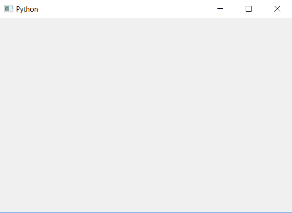

# Python PyQt5–隐藏进度条？

> 原文:[https://www . geesforgeks . org/python-pyqt 5-隐藏进度条/](https://www.geeksforgeeks.org/python-pyqt5-hiding-the-progress-bar/)

在本文中，我们将看到如何在 PyQt5 应用程序中隐藏进度条。有两种方法可以隐藏进度–

1.  **Use the `hide` method.**
***   Set the visibility status of the progress bar to false.**

**方法#1 :**

借助`hide`方法，我们可以隐藏进度条。下面是实现。

```
# importing libraries
from PyQt5.QtWidgets import * 
from PyQt5 import QtCore, QtGui
from PyQt5.QtGui import * 
from PyQt5.QtCore import * 
import sys

class Window(QMainWindow):

    def __init__(self):
        super().__init__()

        # setting title
        self.setWindowTitle("Python ")

        # setting geometry
        self.setGeometry(100, 100, 600, 400)

        # calling method
        self.UiComponents()

        # showing all the widgets
        self.show()

    # method for widgets
    def UiComponents(self):
        # creating progress bar
        bar = QProgressBar(self)

        # setting geometry to progress bar
        bar.setGeometry(200, 100, 200, 30)

        # setting the value
        bar.setValue(100)
        bar.setFormat("Welcome geeks to geeks portal")

        # setting alignment to center
        bar.setAlignment(Qt.AlignCenter)

        # hiding the progress bar
        bar.hide()

App = QApplication(sys.argv)

# create the instance of our Window
window = Window()

# start the app
sys.exit(App.exec())
```

**输出:**


**方法#2:**

借助`SetVisible`方法，我们可以隐藏进度条。下面是实现。

```
# importing libraries
from PyQt5.QtWidgets import * 
from PyQt5 import QtCore, QtGui
from PyQt5.QtGui import * 
from PyQt5.QtCore import * 
import sys

class Window(QMainWindow):

    def __init__(self):
        super().__init__()

        # setting title
        self.setWindowTitle("Python ")

        # setting geometry
        self.setGeometry(100, 100, 600, 400)

        # calling method
        self.UiComponents()

        # showing all the widgets
        self.show()

    # method for widgets
    def UiComponents(self):
        # creating progress bar
        bar = QProgressBar(self)

        # setting geometry to progress bar
        bar.setGeometry(200, 100, 200, 30)

        # setting the value
        bar.setValue(100)
        bar.setFormat("Welcome geeks to geeks portal")

        # setting alignment to center
        bar.setAlignment(Qt.AlignCenter)

        # setting visibility status to False
        bar.setVisible(False)

App = QApplication(sys.argv)

# create the instance of our Window
window = Window()

# start the app
sys.exit(App.exec())
```

**输出:**
