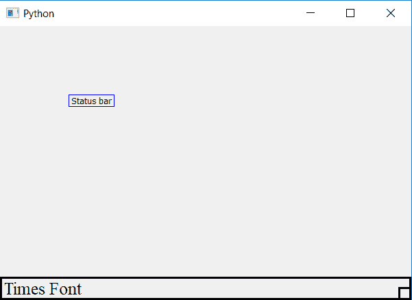

# Python PyQt5–如何更改状态栏消息的字体和大小

> 原文:[https://www . geesforgeks . org/python-pyqt 5-如何更改状态栏字体和大小-消息/](https://www.geeksforgeeks.org/python-pyqt5-how-to-change-font-and-size-of-status-bar-message/)

我们可以使用`showMessage()`方法将消息设置为状态栏。在本文中，我们将看到如何更改 StatusBar 消息的字体和大小。为了做到这一点，我们将使用`setFont()`方法。

> **语法:** self.statusBar()。设置字体(QFont(字体名称，字体大小))
> 
> **论证:**需要两个论证:
> 1。字体名称可以是' Arial '，' Times '等。
> 2。要设置为整数的大小。
> 
> **执行的操作:**改变消息的字体和大小

**代码:**

```py
from PyQt5.QtCore import * 
from PyQt5.QtGui import * 
from PyQt5.QtWidgets import * 
import sys

class Window(QMainWindow):
    def __init__(self):
        super().__init__()

        # set the title
        self.setWindowTitle("Python")

        # setting  the geometry of window
        self.setGeometry(60, 60, 600, 400)

        # setting status bar message
        self.statusBar().showMessage("Times Font")

        # setting  border 
        self.statusBar().setStyleSheet("border :3px solid black;")

        # setting font and size
        self.statusBar().setFont(QFont('Times', 15))

        # creating a label widget
        self.label_1 = QLabel("Status bar", self)

        # moving position
        self.label_1.move(100, 100)

        # setting up the border
        self.label_1.setStyleSheet("border :1px solid blue;")

        # resizing label
        self.label_1.adjustSize()

        # show all the widgets
        self.show()

# create pyqt5 app
App = QApplication(sys.argv)

# create the instance of our Window
window = Window()

# start the app
sys.exit(App.exec())
```

**输出:**
