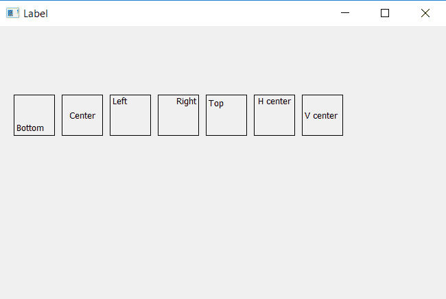

# pyqt 5 中的 Qt 对齐

> 原文:[https://www.geeksforgeeks.org/qt-alignment-in-pyqt5/](https://www.geeksforgeeks.org/qt-alignment-in-pyqt5/)

在 PyQt5 中，Qt 对齐用于设置小部件的对齐。为了使用 Qt 对齐方法，我们必须从 QtCore 类导入 Qt。

```
from PyQt5.QtCore import Qt
```

> Qt 比对的方法有很多:
> 1。Qt。对齐
> 2。Qt。对准
> 3。Qt。AlignBottom
> 4。Qt。
> 落井下石 5。Qt。对准中心
> 6。Qt。对准中心
> 7。Qt。对齐中心

**注意:**也有一些像 Qt 这样的比对方法。校准但它们在 PyQt4 中工作，而不是在 PyQt5 中。

**代码:**
代码将显示所有这些方法，并有助于更好地理解差异。

## 蟒蛇 3

```
# importing the required libraries

from PyQt5.QtWidgets import *
from PyQt5.QtCore import Qt
from PyQt5.QtGui import *
import sys

class Window(QMainWindow):
    def __init__(self):
        super().__init__()

        # set the title
        self.setWindowTitle("Label")

        # setting  the geometry of window
        self.setGeometry(0, 0, 650, 400)

        # creating a label widget and setting properties
        self.label_1 = QLabel("Bottom", self)
        self.label_1.move(20, 100)
        self.label_1.resize(60, 60)
        self.label_1.setStyleSheet("border: 1px solid black;")

        # aligning label to the bottom
        self.label_1.setAlignment(Qt.AlignBottom)

        # creating a label widget and setting properties
        self.label_2 = QLabel("Center", self)
        self.label_2.move(90, 100)
        self.label_2.resize(60, 60)
        self.label_2.setStyleSheet("border: 1px solid black;")

        # aligning label to the center
        self.label_2.setAlignment(Qt.AlignCenter)

        # creating a label widget and setting properties
        self.label_3 = QLabel("Left", self)
        self.label_3.move(160, 100)
        self.label_3.resize(60, 60)
        self.label_3.setStyleSheet("border: 1px solid black;")

        # aligning label to the left
        self.label_3.setAlignment(Qt.AlignLeft)

        # creating a label widget and setting properties
        self.label_4 = QLabel("Right", self)
        self.label_4.move(230, 100)
        self.label_4.resize(60, 60)
        self.label_4.setStyleSheet("border: 1px solid black;")

        # aligning label to the right
        self.label_4.setAlignment(Qt.AlignRight)

        # creating a label widget and setting properties
        self.label_5 = QLabel("Top", self)
        self.label_5.move(300, 100)
        self.label_5.resize(60, 60)
        self.label_5.setStyleSheet("border: 1px solid black;")

        # aligning label to the top
        self.label_5.setAlignment(Qt.AlignTop)

        # creating a label widget and setting properties
        self.label_6 = QLabel("H center", self)
        self.label_6.move(370, 100)
        self.label_6.resize(60, 60)
        self.label_6.setStyleSheet("border: 1px solid black;")

        # aligning label to the Hcenter
        self.label_6.setAlignment(Qt.AlignHCenter)

        # creating a label widget and setting properties
        self.label_7 = QLabel("V center", self)
        self.label_7.move(440, 100)
        self.label_7.resize(60, 60)
        self.label_7.setStyleSheet("border: 1px solid black;")

        # aligning label to the Vcenter
        self.label_7.setAlignment(Qt.AlignVCenter)

        # show all the widgets
        self.show()

# create pyqt5 app
App = QApplication(sys.argv)

# create the instance of our Window
window = Window()

# start the app
sys.exit(App.exec())
```

**输出:**

