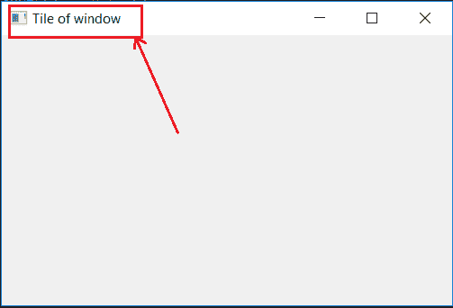

# 在 PyQt5 中设置窗口标题–设置窗口标题

> 原文:[https://www . geesforgeks . org/set-title-window-in-pyqt 5-set window title/](https://www.geeksforgeeks.org/set-title-of-window-in-pyqt5-setwindowtitle/)

PyQt5 是 Qt v5 的一套全面的 Python 绑定。它被实现为 35 个以上的扩展模块，并使 Python 能够在所有支持的平台(包括 iOS 和 Android)上用作 C++的替代应用程序开发语言。
在本文中，我们将看到如何在 PyQt5 中设置窗口的标题。为此使用了 setWindowTitle()方法，该方法属于 QWidget 类。

> **语法:**self . setwindowTitle(title)
> T3】引数:它以 title 即字符串作为引数。

下面是 Python 实现–

## 蟒蛇 3

```py
# importing the required libraries
from PyQt5.QtGui import *
from PyQt5.QtWidgets import *
import sys

class Window(QMainWindow):
    def __init__(self):
        super().__init__()

        # string value
        title = "Title of window"

        # set the title
        self.setWindowTitle(title)

        # setting  the geometry of window
        self.setGeometry(0, 0, 500, 300)

        # show all the widgets
        self.show()

# create pyqt5 app
App = QApplication(sys.argv)

# create the instance of our Window
window = Window()

# start the app
sys.exit(App.exec())
```

**输出:**

