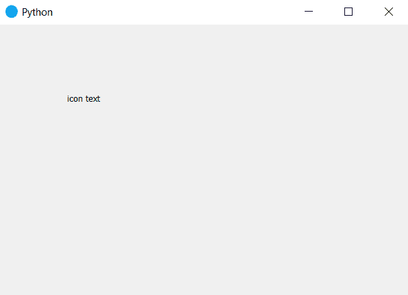

# 在 PyQt5 | setWindowIconText()方法中设置窗口图标文本

> 原文:[https://www . geesforgeks . org/set-window-icon-text-in-pyqt 5-setwindowicontext-method/](https://www.geeksforgeeks.org/set-window-icon-text-in-pyqt5-setwindowicontext-method/)

PyQt5 允许我们使用 setWindowIcon()方法设置窗口的图标，另一方面 setWindowIconText()方法也在其中，它允许我们设置图标的文本。

虽然不建议使用，因为它没有任何用途，但在以前的旧版本中也有使用。它现在被用来使旧的源代码工作。它曾被窗口管理器使用，现在不再使用了。

> **语法:**self . setwindowicontext(“text”)
> **引数:**它以字符串为引数。
> **返回:**如果没有设置图标，将返回空字符串，否则返回之前设置的文本。

**代码:**

## 蟒蛇 3

```py
# importing the required libraries

from PyQt5.QtCore import *
from PyQt5.QtGui import *
from PyQt5.QtWidgets import *
import sys

class Window(QMainWindow):

    def __init__(self):
        super().__init__()

        # set the title
        self.setWindowTitle("Python")

        # setting window icon
        self.setWindowIcon(QIcon("logo.png"))

        # setting icon text
        self.setWindowIconText("logo")

        # setting  the geometry of window
        self.setGeometry(60, 60, 600, 400)

        # creating a label widget
        self.label_1 = QLabel("icon text ", self)
        # moving position
        self.label_1.move(100, 100)

        self.label_1.adjustSize()

        # show all the widgets
        self.show()

# create pyqt5 app
App = QApplication(sys.argv)

# create the instance of our Window
window = Window()
# start the app
sys.exit(App.exec())
```

**输出:**



**注意:**不建议在代码中使用这种方法，因为它对现代系统没有用处。