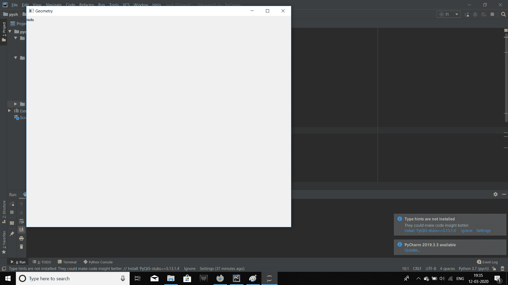

# 设置几何方法–pyqt 5

> 原文:[https://www.geeksforgeeks.org/setgeometry-method-pyqt5/](https://www.geeksforgeeks.org/setgeometry-method-pyqt5/)

Python 提供了这么多开发 GUI 应用程序的选项，PyQt5 就是其中之一。PyQt5 是跨平台的 GUI 工具包，是一组针对 Qt v5 的 python 绑定。由于该库提供的工具和简单性，人们可以非常容易地开发交互式桌面应用程序。

`**setGeometry()**`方法用于设置 PyQt5 窗口的几何形状。

> **语法:** window.setGeometry(x，y，宽度，高度)
> 
> **参数:**需要 4 个参数:
> 1。x 坐标
> 2。y 坐标
> 3。要设置的窗口宽度
> 4。要设置的窗口高度

下面是这个方法的实现。

**代码:**

```py
# importing the required libraries
from PyQt5.QtGui import * 
from PyQt5.QtWidgets import * 
import sys

class Window(QMainWindow):
    def __init__(self):
        super().__init__()

        # set the title
        self.setWindowTitle("Geometry")

        # setting  the geometry of window
        # setGeometry(left, top, width, height)
        self.setGeometry(100, 60, 1000, 800)

        # creating a label widget
        self.widget = QLabel('Hello', self)

        # show all the widgets
        self.show()

# create pyqt5 app
App = QApplication(sys.argv)

# create the instance of our Window
window = Window()
# start the app
sys.exit(App.exec())
```

**输出:**
