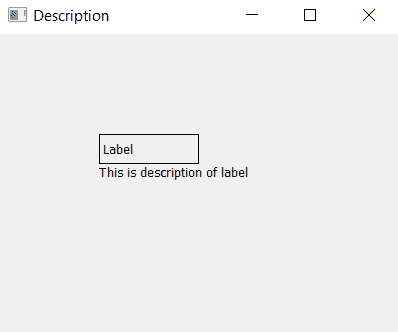

# 设置和访问标签名称–pyqt 5

> 原文:[https://www . geeksforgeeks . org/设置和访问标签名称-pyqt5/](https://www.geeksforgeeks.org/setting-and-accessing-name-of-a-label-pyqt5/)

在本文中，我们将了解如何设置和访问标签的描述。
一个**标签**是一个图形控制元素，在表单上显示文本。它通常是静态控件；没有交互性。标签通常用于标识附近的文本框或其他小部件。**标签的描述**是标签的细节，设置描述有助于更好地理解细节，便于后端使用。

**设置描述–**

> **语法:**label . setaccessibledescription(details)
> T3】引数:它以字符串为引数。
> **返回:**无返回值。

**进入描述–**

> **语法:**label . accessibledescription()
> **参数:**不需要参数。
> **返回:**返回字符串。

**代码:**

```py
# importing the required libraries

from PyQt5.QtWidgets import * 
from PyQt5 import QtCore
from PyQt5 import QtGui
import sys

class Window(QMainWindow):
    def __init__(self):
        super().__init__()

        # set the title
        self.setWindowTitle("Description")

        # setting  the geometry of window
        self.setGeometry(0, 0, 400, 300)

        # creating a label widget
        self.label_1 = QLabel("Label", self)

        # moving position
        self.label_1.move(100, 100)

        # setting up border
        self.label_1.setStyleSheet("border: 1px solid black;")

        # setting up the description of label_1
        self.label_1.setAccessibleDescription(
                      "This is description of label")

        # getting description of label_1
        info = self.label_1.accessibleDescription()

        # new label to display info
        self.label_2 = QLabel(info, self)
        self.label_2.move(100, 130)
        self.label_2.adjustSize()

        # show all the widgets
        self.show()

# create pyqt5 app
App = QApplication(sys.argv)

# create the instance of our Window
window = Window()

# start the app
sys.exit(App.exec())
```

**输出:**
