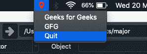

# 使用 PyQt5 的系统托盘应用

> 原文:[https://www . geesforgeks . org/system-tray-applications-using-pyqt 5/](https://www.geeksforgeeks.org/system-tray-applications-using-pyqt5/)

在本文中，我们将学习如何使用 PyQt 创建一个系统托盘应用程序。

**系统托盘**(或**菜单栏**)是操作系统中任务栏上的一个区域。如果你使用的是 windows，你可以在桌面的右下角找到这个系统，如果你使用的是 macOS，你可以在右上角找到。在该通知区域中可见的图标是在前台运行的图标。一些著名的应用程序使用系统托盘来运行，它们是 Windscribe(虚拟专用网应用程序)和 Adobe Creative Cloud。

菜单栏应用程序对于使用菜单栏图标中提供的快捷方式来最低限度地控制桌面应用程序也很有用。只需使用系统托盘上提供的选项，就可以选择不打开整个应用程序而仍然工作。在本文中，您将学习如何创建这些应用程序。

下面是一个名为 Windscribe 的应用程序的例子。
T3】

**代码:**

```
from PyQt5.QtGui import * 
from PyQt5.QtWidgets import * 

app = QApplication([])
app.setQuitOnLastWindowClosed(False)

# Adding an icon
icon = QIcon("icon.png")

# Adding item on the menu bar
tray = QSystemTrayIcon()
tray.setIcon(icon)
tray.setVisible(True)

# Creating the options
menu = QMenu()
option1 = QAction("Geeks for Geeks")
option2 = QAction("GFG")
menu.addAction(option1)
menu.addAction(option2)

# To quit the app
quit = QAction("Quit")
quit.triggered.connect(app.quit)
menu.addAction(quit)

# Adding options to the System Tray
tray.setContextMenu(menu)

app.exec_()
```

**输出:**


正如你所看到的，在我的 mac 菜单栏上有一个标记图标，有三个选项可见，即极客的极客，GFG 和退出。通过点击最后一个选项(退出)，您将退出应用程序。