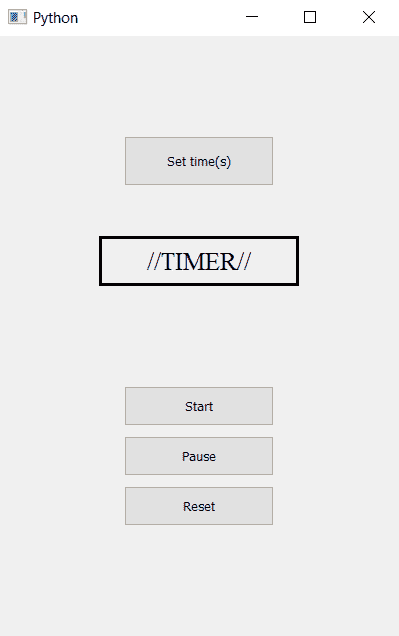

# 使用 PyQt5 的计时器应用

> 原文:[https://www . geesforgeks . org/timer-application-use-pyqt 5/](https://www.geeksforgeeks.org/timer-application-using-pyqt5/)

在本文中，我们将看到如何在 PyQt5 中创建计时器应用程序。计时器是一种特殊类型的时钟，用于测量特定的时间间隔，对于给定的时间，我们必须减少时间，直到时间变为零，即向下计数。


> **GUI 实现步骤:**
> 
> 1.创建一个按钮打开弹出窗口获取时间并设置其几何形状
> 2。创建标签以显示时间和完成状态
> 3。设置标签的几何形状、字体大小，并将其文本居中对齐
> 4。创建三个启动定时器、暂停定时器和重置定时器的按钮
> 5。设置每个按钮的几何形状
> 
> **后端实现步骤:**
> 
> 1.创建计数变量和标志，以了解计数器是否停止或运行
> 2。给每个按钮增加动作
> 3。在获取第二个按钮操作中，使用输入对话框获取第二个值，并使标志为假
> 4。在启动动作中，使标志为真，但如果计数为零，则使标志为假
> 5。
> 内暂停动作使旗假 6。在重置动作中，使标志为假，将计数值设置为零，并将文本设置为标签
> 7。每隔 100 毫秒
> 8 制作一个调用其方法的定时器对象。在计时器操作中，检查标志，然后递减计数值，并为标签设置文本

下面是实现

```py
# importing libraries
from PyQt5.QtWidgets import * 
from PyQt5 import QtCore, QtGui
from PyQt5.QtGui import * 
from PyQt5.QtCore import * 
import sys

class Window(QMainWindow):

    def __init__(self):
        super().__init__()

        # setting title
        self.setWindowTitle("Python ")

        # setting geometry
        self.setGeometry(100, 100, 400, 600)

        # calling method
        self.UiComponents()

        # showing all the widgets
        self.show()

    # method for widgets
    def UiComponents(self):

        # variables
        # count variable
        self.count = 0

        # start flag
        self.start = False

        # creating push button to get time in seconds
        button = QPushButton("Set time(s)", self)

        # setting geometry to the push button
        button.setGeometry(125, 100, 150, 50)

        # adding action to the button
        button.clicked.connect(self.get_seconds)

        # creating label to show the seconds
        self.label = QLabel("//TIMER//", self)

        # setting geometry of label
        self.label.setGeometry(100, 200, 200, 50)

        # setting border to the label
        self.label.setStyleSheet("border : 3px solid black")

        # setting font to the label
        self.label.setFont(QFont('Times', 15))

        # setting alignment ot the label
        self.label.setAlignment(Qt.AlignCenter)

        # creating start button
        start_button = QPushButton("Start", self)

        # setting geometry to the button
        start_button.setGeometry(125, 350, 150, 40)

        # adding action to the button
        start_button.clicked.connect(self.start_action)

        # creating pause button
        pause_button = QPushButton("Pause", self)

        # setting geometry to the button
        pause_button.setGeometry(125, 400, 150, 40)

        # adding action to the button
        pause_button.clicked.connect(self.pause_action)

        # creating reset  button
        reset_button = QPushButton("Reset", self)

        # setting geometry to the button
        reset_button.setGeometry(125, 450, 150, 40)

        # adding action to the button
        reset_button.clicked.connect(self.reset_action)

        # creating a timer object
        timer = QTimer(self)

        # adding action to timer
        timer.timeout.connect(self.showTime)

        # update the timer every tenth second
        timer.start(100)

    # method called by timer
    def showTime(self):

        # checking if flag is true
        if self.start:
            # incrementing the counter
            self.count -= 1

            # timer is completed
            if self.count == 0:

                # making flag false
                self.start = False

                # setting text to the label
                self.label.setText("Completed !!!! ")

        if self.start:
            # getting text from count
            text = str(self.count / 10) + " s"

            # showing text
            self.label.setText(text)

    # method called by the push button
    def get_seconds(self):

        # making flag false
        self.start = False

        # getting seconds and flag
        second, done = QInputDialog.getInt(self, 'Seconds', 'Enter Seconds:')

        # if flag is true
        if done:
            # changing the value of count
            self.count = second * 10

            # setting text to the label
            self.label.setText(str(second))

    def start_action(self):
        # making flag true
        self.start = True

        # count = 0
        if self.count == 0:
            self.start = False

    def pause_action(self):

        # making flag false
        self.start = False

    def reset_action(self):

        # making flag false
        self.start = False

        # setting count value to 0
        self.count = 0

        # setting label text
        self.label.setText("//TIMER//")

# create pyqt5 app
App = QApplication(sys.argv)

# create the instance of our Window
window = Window()

# start the app
sys.exit(App.exec())
```

**输出:**

<video class="wp-video-shortcode" id="video-400010-1" width="665" height="374" preload="metadata" controls=""><source type="video/mp4" src="https://media.geeksforgeeks.org/wp-content/uploads/20200417202034/screen_recorder_video_2020_17_4_20_19_16.mp4?_=1">[https://media.geeksforgeeks.org/wp-content/uploads/20200417202034/screen_recorder_video_2020_17_4_20_19_16.mp4](https://media.geeksforgeeks.org/wp-content/uploads/20200417202034/screen_recorder_video_2020_17_4_20_19_16.mp4)</video>