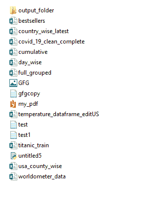
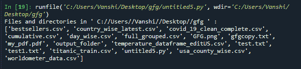
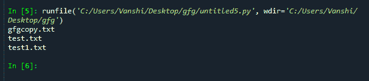

# Python–在目录中列出文件

> 原文:[https://www . geesforgeks . org/python-list-file-in-a-directory/](https://www.geeksforgeeks.org/python-list-files-in-a-directory/)

[目录](https://www.geeksforgeeks.org/create-a-directory-in-python/)有时也称为文件夹，是计算机文件系统中用于存储和定位文件或多个文件夹的单位组织结构。Python 现在支持许多列出目录内容的 API。例如，我们可以使用 Path.iterdir、 [os.scandir](https://www.geeksforgeeks.org/python-os-scandir-method/) 、 [os.walk](https://www.geeksforgeeks.org/os-walk-python/) 、 [Path.rglob](https://www.geeksforgeeks.org/how-to-use-glob-function-to-find-files-recursively-in-python/) 或 [os.listdir](https://www.geeksforgeeks.org/python-os-listdir-method/) 功能。

**正在使用的目录:** gfg



### **方法 1: Os 模块**

*   **[**OS . listdir()**](https://www.geeksforgeeks.org/python-os-listdir-method/)方法获取指定目录下所有文件和目录的列表。默认情况下，它是当前目录。**

****语法**:**

```
os.listdir(path)
```

****参数**:**

**目录的路径**

****返回类型**:返回指定路径下所有文件和目录的列表**

****例 1:****

## **计算机编程语言**

```
# import OS module
import os

# Get the list of all files and directories
path = "C://Users//Vanshi//Desktop//gfg"
dir_list = os.listdir(path)

print("Files and directories in '", path, "' :")

# prints all files
print(dir_list)
```

****输出:****

****

****程序 2:** 只获取 txt 文件。**

## **蟒蛇 3**

```
#import OS
import os

for x in os.listdir():
    if x.endswith(".txt"):
        # Prints only text file present in My Folder
        print(x)
```

****输出:****

****

*   ****[**OS . walk()**](https://www.geeksforgeeks.org/os-walk-python/)在目录树中生成文件名。****

## ****蟒蛇 3****

```
**# import OS module
import os

# This is my path
path="C://Users//Vanshi//Desktop//gfg"

# to store files in a list
list = []

# dirs=directories
for (root, dirs, file) in os.walk(path):
    for f in file:
        if '.txt' in f:
            print(f)**
```