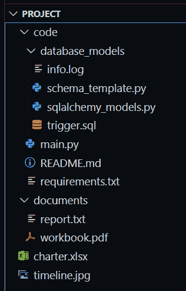

# Python–在扩展名为

的目录中列出文件

> 原文:[https://www . geesforgeks . org/python-list-file-in-directory-in-with-extension/](https://www.geeksforgeeks.org/python-list-files-in-directory-with-extension/)

在本文中，我们将讨论不同的用例，在这些用例中，我们希望使用 python 列出目录中的文件及其扩展名。

## 使用的模块

*   [os](https://www.geeksforgeeks.org/os-module-python-examples/):Python 中的 OS 模块提供了与操作系统交互的功能。
*   [glob](https://www.geeksforgeeks.org/how-to-use-glob-function-to-find-files-recursively-in-python/) : 在 Python 中，glob 模块用于检索符合指定模式的 **文件/路径名** 。glob 的模式规则遵循标准的 Unix 路径扩展规则。据预测，根据基准，它比其他方法更快地匹配目录中的路径名。

## 正在使用的目录结构:



目录结构根视图


目录文件的可视化表示

## 方法 1:使用“操作系统”模块

该模块提供了一种使用操作系统相关功能的可移植方式。方法[***OS . listdir()***T5】列出一个目录中存在的所有文件。如果我们也想使用子目录，我们可以使用](https://www.geeksforgeeks.org/python-os-listdir-method/)[***OS . walk()***](https://www.geeksforgeeks.org/os-walk-python/)。

**语法:**

> *是操作系统的列表(path = .)*

返回一个列表，其中包含由路径给出的目录中的条目名称。

**语法:**

> os.walk(顶部，自上而下=真，一个错误=无，跟随链接=假)

通过自上而下或自下而上遍历目录树来生成目录树中的文件名。

**示例 1:** 列出 ***根目录/首页/项目*** 中存在的文件和目录

## 计算机编程语言

```py
import os

# To get directories as well as files present
# in a path
list_1 = os.listdir(path=r"root/home/project")
print(list_1)

# To get only files present in a path
list_2 = os.listdir(path=r"root/home/project")

# Loop through each value in the list_2
for val in list_2:

    # Remove the value from list_2 if the "." is 
    # not present in value
    if "." not in val:
        list_2.remove(val)
print(list_2)
```

**输出:**

```py
['documents', 'code', 'charter.xlsx', 'timeline.jpg']
['charter.xlsx', 'timeline.jpg']
```

**示例 2:** 列出 ***根目录/首页/项目*** 中存在的所有子目录和子文件

## 计算机编程语言

```py
import os

all_files = list()
all_dirs = list()

# Iterate for each dict object in os.walk()
for root, dirs, files in os.walk("root/home/project"):
    # Add the files list to the the all_files list
    all_files.extend(files)
    # Add the dirs list to the all_dirs list
    all_dirs.extend(dirs)

print(all_files)
print(all_dirs)
```