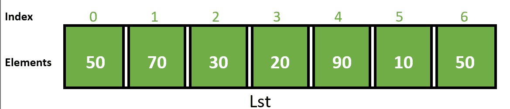
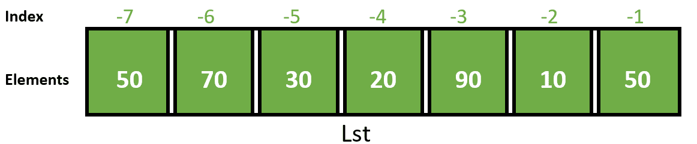
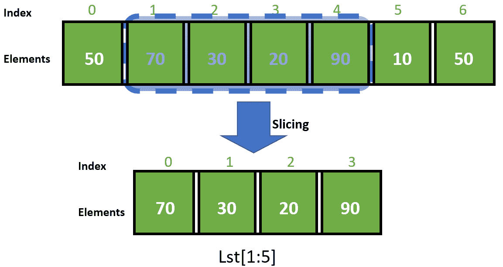

# Python 列表切片

> 原文:[https://www.geeksforgeeks.org/python-list-slicing/](https://www.geeksforgeeks.org/python-list-slicing/)

在 Python 中，列表切片是一种常见的做法，也是程序员解决高效问题最常用的技术。考虑一个 python 列表，为了访问列表中的一系列元素，需要对列表进行切片。一种方法是使用简单的切片操作符，即冒号( *:* )

使用这个操作符，可以指定从哪里开始切片，从哪里结束，以及指定步骤。列表切片从现有列表中返回一个新列表。

**语法:**

```py
Lst[ Initial : End : IndexJump ]
```

如果 *Lst* 是一个列表，那么上面的表达式返回列表中从索引*初始*到索引*结束*的部分，步长为*索引跳转*。

### 索引

**1。正指数**



下面是一个简单的程序，使用切片显示整个列表。

## 蟒蛇 3

```py
# Initialize list
Lst = [50, 70, 30, 20, 90, 10, 50]

# Display list
print(Lst[::])
```

**输出:**

```py
[50, 70, 30, 20, 90, 10, 50]
```

上图展示了一个列表 *Lst* 及其索引值和元素。

**2。负指数**

现在，让我们看看下图，它展示了一个列表及其负索引。



Index -1 表示列表的最后一个元素， *-n* 表示列表的第一个元素(考虑 *n* 作为列表的长度)。也可以使用负索引来操作列表。

## 蟒蛇 3

```py
# Initialize list
Lst = [50, 70, 30, 20, 90, 10, 50]

# Display list
print(Lst[-7::1])
```

**输出:**

```py
[50, 70, 30, 20, 90, 10, 50]
```

上面的程序在列表切片中使用负索引显示整个列表。

**3。切片**

如前所述，列表切片是 Python 中的一种常见做法，既可以用于正索引，也可以用于负索引。下图说明了列表切片技术:



下面的程序将上面的图转换成 python 代码:

## 蟒蛇 3

```py
# Initialize list
Lst = [50, 70, 30, 20, 90, 10, 50]

# Display list
print(Lst[1:5])
```

**输出:**

```py
[70, 30, 20, 90]
```

下面是一些描述列表切片在 Python 中的使用的例子:

**例 1:**

## 蟒蛇 3

```py
# Initialize list
List = [1, 2, 3, 4, 5, 6, 7, 8, 9]

# Show original list
print("\nOriginal List:\n", List)

print("\nSliced Lists: ")

# Display sliced list
print(List[3:9:2])

# Display sliced list
print(List[::2])

# Display sliced list
print(List[::])
```

**输出:**

```py
Original List:
 [1, 2, 3, 4, 5, 6, 7, 8, 9]

Sliced Lists: 
[4, 6, 8]
[1, 3, 5, 7, 9]
[1, 2, 3, 4, 5, 6, 7, 8, 9]
```

将任何参数如*初始*、*结束*或*索引跳转*留空将导致使用默认值，即 0 作为*初始*，列表长度作为*结束*，1 作为*索引跳转*。

**例 2:**

## 蟒蛇 3

```py
# Initialize list
List = ['Geeks', 4, 'geeks !']

# Show original list
print("\nOriginal List:\n", List)

print("\nSliced Lists: ")

# Display sliced list
print(List[::-1])

# Display sliced list
print(List[::-3])

# Display sliced list
print(List[:1:-2])
```

**输出:**

```py
Original List:
 ['Geeks', 4, 'geeks !']

Sliced Lists: 
['geeks !', 4, 'Geeks']
['geeks !']
['geeks !']
```

通过使用负整数作为*索引跳转*参数*，可以生成一个反向列表。*保留*初始*和*结束*为空白*。*如果*索引跳转*值为负，我们需要根据一个反向列表选择*初始*和*结束*值。

**例 3:**

## 蟒蛇 3

```py
# Initialize list
List = [-999, 'G4G', 1706256, '^_^', 3.1496]

# Show original list
print("\nOriginal List:\n", List)

print("\nSliced Lists: ")

# Display sliced list
print(List[10::2])

# Display sliced list
print(List[1:1:1])

# Display sliced list
print(List[-1:-1:-1])

# Display sliced list
print(List[:0:])
```

**输出:**

```py
Original List:
 [-999, 'G4G', 1706256, '^_^', 3.1496]

Sliced Lists: 
[]
[]
[]
[]
```

如果生成了一些没有意义或不可计算的切片表达式，则会生成空列表。

**例 4:**

## 蟒蛇 3

```py
# Initialize list
List = [-999, 'G4G', 1706256, 3.1496, '^_^']

# Show original list
print("\nOriginal List:\n", List)

print("\nSliced Lists: ")

# Modified List
List[2:4] = ['Geeks', 'for', 'Geeks', '!']

# Display sliced list
print(List)

# Modified List
List[:6] = []

# Display sliced list
print(List)
```

**输出:**

```py
Original List:
 [-999, 'G4G', 1706256, 3.1496, '^_^']

Sliced Lists: 
[-999, 'G4G', 'Geeks', 'for', 'Geeks', '!', '^_^']
['^_^']
```

列表切片可用于修改列表，甚至从列表中删除元素。

**例 5:**

## 蟒蛇 3

```py
# Initialize list
List = [1, 2, 3, 4, 5, 6, 7, 8, 9]

# Show original list
print("\nOriginal List:\n", List)

print("\nSliced Lists: ")

# Creating new List
newList = List[:3]+List[7:]

# Display sliced list
print(newList)

# Changing existing List
List = List[::2]+List[1::2]

# Display sliced list
print(List)
```

**输出:**

```py
Original List:
 [1, 2, 3, 4, 5, 6, 7, 8, 9]

Sliced Lists: 
[1, 2, 3, 8, 9]
[1, 3, 5, 7, 9, 2, 4, 6, 8]
```

通过连接切片列表，可以创建新列表，甚至可以修改预先存在的列表。