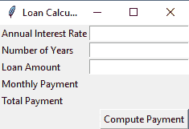

# Python |使用 Tkinter 的贷款计算器

> 原文:[https://www . geesforgeks . org/python-loan-calculator-using-tkinter/](https://www.geeksforgeeks.org/python-loan-calculator-using-tkinter/)

先决条件: [Tkinter 简介](https://www.geeksforgeeks.org/python-gui-tkinter/)

Python 为开发图形用户界面提供了多个选项。在所有的 GUI 方法中，Tkinter 是最常用的方法。它是 Python 附带的 Tk 图形用户界面工具包的标准 Python 接口。Python 搭配 Tkinter 输出了创建 GUI 应用程序最快最简单的方法。使用 Tkinter 创建图形用户界面是一项简单的任务。

**要创建 Tkinter :**

1.  导入模块–Tkit
2.  创建主窗口(容器)
3.  向主窗口添加任意数量的小部件
4.  在小部件上应用事件触发器。

图形用户界面如下所示:



让我们看看如何使用 Python GUI 库 Tkinter 创建一个贷款计算器。计算器将能够根据贷款金额、期限和利率计算总额和每月付款。
**第一步:**创建主窗口。

## 蟒蛇 3

```py
def __init__(self):
    # Create a window
    window = Tk()
    window.title("Loan Calculator") # Set title

    # create the input boxes.
    Label(window, text = "Annual Interest Rate").grid(row = 1,
                                       column = 1, sticky = W)
    Label(window, text = "Number of Years").grid(row = 2,
                                  column = 1, sticky = W)
    Label(window, text = "Loan Amount").grid(row = 3,
                              column = 1, sticky = W)
    Label(window, text = "Monthly Payment").grid(row = 4,
                                  column = 1, sticky = W)
    Label(window, text = "Total Payment").grid(row = 5,
                                column = 1, sticky = W)

    # for taking inputs
    self.annualInterestRateVar = StringVar()   
    Entry(window, textvariable = self.annualInterestRateVar,
                 justify = RIGHT).grid(row = 1, column = 2)

    self.numberOfYearsVar = StringVar()
    Entry(window, textvariable = self.numberOfYearsVar,
            justify = RIGHT).grid(row = 2, column = 2)

    self.loanAmountVar = StringVar()
    Entry(window, textvariable = self.loanAmountVar,
         justify = RIGHT).grid(row = 3, column = 2)

    self.monthlyPaymentVar = StringVar()
    lblMonthlyPayment = Label(window, textvariable =
                self.monthlyPaymentVar).grid(row = 4,
                column = 2, sticky = E)

    self.totalPaymentVar = StringVar()
    lblTotalPayment = Label(window, textvariable =
                self.totalPaymentVar).grid(row = 5,
                column = 2, sticky = E)

    # create the button
    btComputePayment = Button(window, text = "Compute Payment",
                           command = self.computePayment).grid(
                               row = 6, column = 2, sticky = E)
    # Create an event loop
    window.mainloop()
```

**步骤 2:** 添加功能。

## 蟒蛇 3

```py
def computePayment(self):
    # compute the total payment.
    monthlyPayment = self.getMonthlyPayment(float(self.loanAmountVar.get()),
                    float(self.annualInterestRateVar.get()) / 1200,
                    int(self.numberOfYearsVar.get()))

    self.monthlyPaymentVar.set(format(monthlyPayment, '10.2f'))
    totalPayment = float(self.monthlyPaymentVar.get()) * 12 \
                           * int(self.numberOfYearsVar.get())
    self.totalPaymentVar.set(format(totalPayment, '10.2f'))

# compute the monthly payment.
def getMonthlyPayment(self, loanAmount, monthlyInterestRate, numberOfYears):
    monthlyPayment = loanAmount * monthlyInterestRate /
                    (1- 1 / (1 + monthlyInterestRate) **
                    (numberOfYears * 12))

    return monthlyPayment;
```

**第三步:**完成程序

## 蟒蛇 3

```py
# Import tkinter
from tkinter import *
class LoanCalculator:

    def __init__(self):

        window = Tk() # Create a window
        window.title("Loan Calculator") # Set title
        # create the input boxes.
        Label(window, text = "Annual Interest Rate").grid(row = 1,
                                          column = 1, sticky = W)
        Label(window, text = "Number of Years").grid(row = 2,
                                      column = 1, sticky = W)
        Label(window, text = "Loan Amount").grid(row = 3,
                                  column = 1, sticky = W)
        Label(window, text = "Monthly Payment").grid(row = 4,
                                      column = 1, sticky = W)
        Label(window, text = "Total Payment").grid(row = 5,
                                    column = 1, sticky = W)

        # for taking inputs
        self.annualInterestRateVar = StringVar()
        Entry(window, textvariable = self.annualInterestRateVar,
                     justify = RIGHT).grid(row = 1, column = 2)
        self.numberOfYearsVar = StringVar()

        Entry(window, textvariable = self.numberOfYearsVar,
                 justify = RIGHT).grid(row = 2, column = 2)
        self.loanAmountVar = StringVar()

        Entry(window, textvariable = self.loanAmountVar,
              justify = RIGHT).grid(row = 3, column = 2)
        self.monthlyPaymentVar = StringVar()
        lblMonthlyPayment = Label(window, textvariable =
                           self.monthlyPaymentVar).grid(row = 4,
                           column = 2, sticky = E)

        self.totalPaymentVar = StringVar()
        lblTotalPayment = Label(window, textvariable =
                       self.totalPaymentVar).grid(row = 5,
                       column = 2, sticky = E)

        # create the button
        btComputePayment = Button(window, text = "Compute Payment",
                                  command = self.computePayment).grid(
                                  row = 6, column = 2, sticky = E)
        window.mainloop() # Create an event loop

    # compute the total payment.
    def computePayment(self):

        monthlyPayment = self.getMonthlyPayment(
        float(self.loanAmountVar.get()),
        float(self.annualInterestRateVar.get()) / 1200,
        int(self.numberOfYearsVar.get()))

        self.monthlyPaymentVar.set(format(monthlyPayment, '10.2f'))
        totalPayment = float(self.monthlyPaymentVar.get()) * 12 \
                                * int(self.numberOfYearsVar.get())

        self.totalPaymentVar.set(format(totalPayment, '10.2f'))

    def getMonthlyPayment(self, loanAmount, monthlyInterestRate, numberOfYears):
        # compute the monthly payment.
        monthlyPayment = loanAmount * monthlyInterestRate / (1
        - 1 / (1 + monthlyInterestRate) ** (numberOfYears * 12))
        return monthlyPayment;
        root = Tk() # create the widget

 # call the class to run the program.
LoanCalculator()
```

**输出:**

<video class="wp-video-shortcode" id="video-294663-1" width="640" height="360" preload="metadata" controls=""><source type="video/mp4" src="https://media.geeksforgeeks.org/wp-content/uploads/20210214171940/FreeOnlineScreenRecorderProject17.mp4?_=1">[https://media.geeksforgeeks.org/wp-content/uploads/20210214171940/FreeOnlineScreenRecorderProject17.mp4](https://media.geeksforgeeks.org/wp-content/uploads/20210214171940/FreeOnlineScreenRecorderProject17.mp4)</video>

**代码解释:**

*   Tkit 模块包含*【Tk】*工具包*。在这个例子中，我们在第一行导入了 Tkinter 的整个模块。接下来，我们将创建一个名为 LoanCalculator 的用户定义类，它保存自己的数据成员和成员函数。*
*   *def__init__(self)是 Python 类中的一种特殊方法。它是一个 Python 类的构造函数，然后我们使用 Tk()创建一个窗口。label 函数创建一个显示框来接受输入，并使用 grid 方法给它一个类似表格的结构。*

***为什么我们使用粘性论证？**
默认情况下，小部件是在中心创建的，使用粘性参数我们可以更改它。它采用 4 个值:北、南、东、西，即北、东、南、西。* 

*   *然后我们创建一些名为 self.annualInterestRateVar，self.numberOfYearsVar，self.loanAmountVar，self.monthlyPaymentVar，self.totalPaymentVar 的对象，对于前 3 个对象，我们使用 entry()函数进行输入。*
*   *然后我们创建一个按钮，即计算支付，当你点击这个按钮时，它调用属于类贷款计算器的计算支付功能。使用 mainloop 函数，我们运行应用程序。*
*   *在类中创建一个函数 computepayment()。在这里，我们将对象的输入存储在一些变量中，以简化我们的数学计算。*
*   *在下一步中，我们在类中创建另一个名为 getMonthlyPayment()的函数。在获得所需的输入后，它使用程序中给出的简单数学函数来计算每月付款。*
*   *现在 root=Tk()意味着初始化*Tinter*，我们必须创建一个窗口小部件。请注意，根小部件必须在任何其他小部件之前创建。*