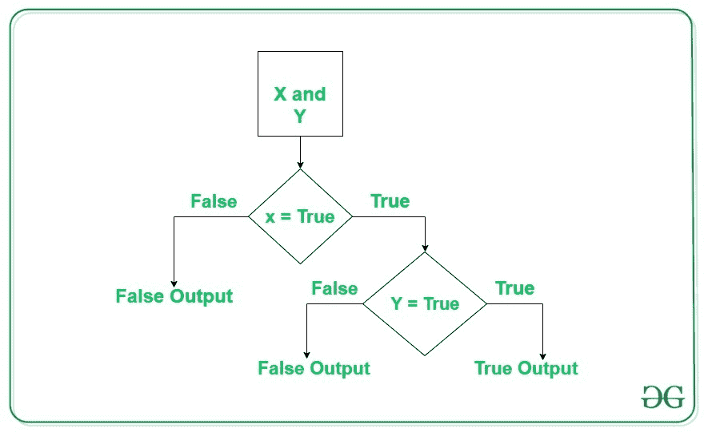
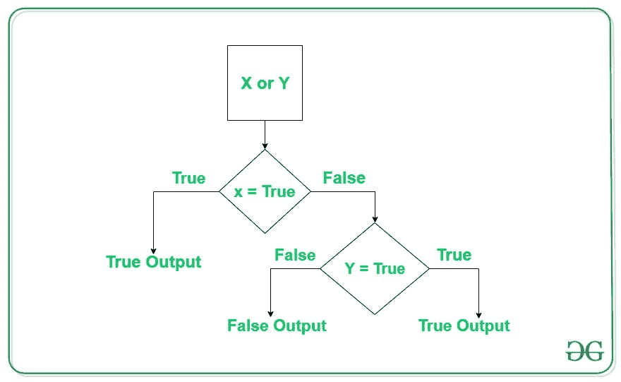
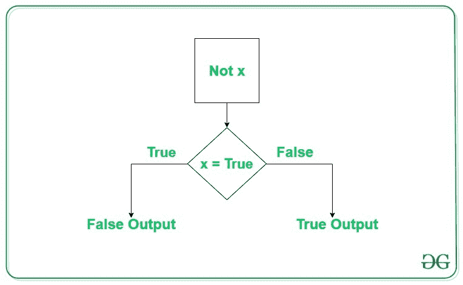

# Python 逻辑运算符示例

> 原文:[https://www . geesforgeks . org/python-逻辑-运算符-带示例-需要改进/](https://www.geeksforgeeks.org/python-logical-operators-with-examples-improvement-needed/)

运算符用于对值和变量执行操作。这些是执行算术和逻辑计算的特殊符号。操作符操作的值称为 ***【操作数】*** 。

> <font size="5">目录</font>
> 
> *   [逻辑运算符](#logical)
>     *   [逻辑与运算符](#and)
>     *   [逻辑或运算符](#or)
>     *   [逻辑非运算符](#not)
> *   [逻辑运算符的求值顺序](#order)

## 逻辑运算符

在 Python 中，逻辑运算符用于条件语句(真或假)。它们执行**逻辑与**、**逻辑或**和**逻辑非**运算。

| 操作员 | 描述 | 句法 |
| --- | --- | --- |
| 和 | 逻辑与:如果两个操作数都为真，则为真 | x 和 y |
| 或者 | 逻辑或:如果任一操作数为真，则为真 | x 或 y |
| 不 | 逻辑非:如果操作数为假，则为真 | 不是 x |

#### 逻辑与运算符

逻辑运算符返回`True` ，如果两个操作数都为真，则返回`False`。



**示例#1:**

```
# Python program to demonstrate
# logical and operator

a = 10
b = 10
c = -10

if a > 0 and b > 0:
    print("The numbers are greater than 0")

if a > 0 and b > 0 and c > 0:
    print("The numbers are greater than 0")
else:
    print("Atleast one number is not greater than 0")
```

**输出:**

```
The numbers are greater than 0
Atleast one number is not greater than 0

```

**例 2:**

```
# Python program to demonstrate
# logical and operator

a = 10
b = 12
c = 0

if a and b and c:
    print("All the numbers have boolean value as True")
else:
    print("Atleast one number has boolean value as False")
```

**输出:**

```
Atleast one number has boolean value as False

```

**注意:**如果第一个表达式在使用 and 运算符时被评估为 false，则不会评估其他表达式。

#### 逻辑或运算符

如果任一操作数为真，则逻辑或运算符返回真。



**示例#1:**

```
# Python program to demonstrate
# logical or operator

a = 10
b = -10
c = 0

if a > 0 or b > 0:
    print("Either of the number is greater than 0")
else:
    print("No number is greater than 0")

if b > 0 or c > 0:
    print("Either of the number is greater than 0")
else:
    print("No number is greater than 0")
```

**输出:**

```
Either of the number is greater than 0
No number is greater than 0

```

**例 2:**

```
# Python program to demonstrate
# logical and operator

a = 10
b = 12
c = 0

if a or b or c:
    print("Atleast one number has boolean value as True")
else:
    print("All the numbers have boolean value as False")
```

**输出:**

```
Atleast one number has boolean value as True

```

**注意:**如果第一个表达式在使用 or 运算符时被评估为真，则不评估其他表达式。

#### 逻辑非运算符

逻辑非运算符处理单个布尔值。如果布尔值为`True` ，则返回`False` ，反之亦然。



**示例:**

```
# Python program to demonstrate
# logical not operator

a = 10

if not a:
    print("Boolean value of a is True")

if not (a%3 == 0 or a%5 == 0):
    print("10 is not divisible by either 3 or 5")
else:
    print("10 is divisible by either 3 or 5")
```

**输出:**

```
10 is divisible by either 3 or 5

```

## 逻辑运算符的求值顺序

在多个运算符的情况下，Python 总是从左到右计算表达式。这可以通过下面的例子来验证。

**示例:**

```
# Python program to demonstrate
# order of evaluation of logical 
# operators

def order(x):
    print("Method called for value:", x)
    return True if x > 0 else False

a = order
b = order
c = order

if a(-1) or b(5) or c(10):
    print("Atleast one of the number is positive")
```

**输出:**

```
Method called for value: -1
Method called for value: 5
Atleast one of the number is positive

```