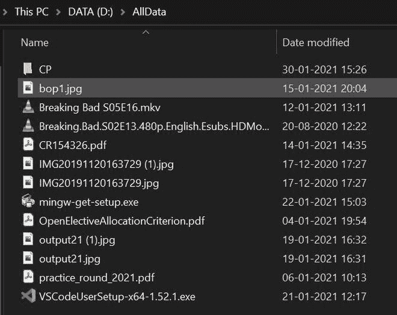

# Python–遍历某些扩展名的文件

> 原文:[https://www . geesforgeks . org/python-循环遍历某些扩展名的文件/](https://www.geeksforgeeks.org/python-loop-through-files-of-certain-extensions/)

一个目录能够存储多个文件，python 可以支持一种机制来循环它们。在本文中，我们将看到不同的方法来迭代给定目录或子目录中的特定文件。

**包含不同文件的路径:**这将用于所有方法。



**方法一:使用** [**listdir()**](https://www.geeksforgeeks.org/python-os-listdir-method/)

在这个方法中，我们将使用 os 库中的 **os.listdir()** 函数。该函数返回目录中存在的文件名列表，没有顺序。

因此，为了从特定目录中获取特定类型的文件，我们需要遍历目录和子目录，并以特定的扩展名打印文件。

**语法:**

> 列表(路径)

**接近**

*   导入 os 库，并在 os.listdir()函数中传递目录。
*   创建一个包含您想要获取的扩展名的元组。
*   通过循环遍历目录中的所有文件，并打印具有特定扩展名的文件。
*   endswith()函数检查文件是否以该特定扩展名结尾，然后打印文件名。

**示例:**

## 蟒蛇 3

```py
# importing the library
import os

# giving directory name
dirname = 'D:\\AllData'

# giving file extension
ext = ('.exe', 'jpg')

# iterating over all files
for files in os.listdir(dirname):
    if files.endswith(ext):
        print(files)  # printing file name of desired extension
    else:
        continue
```