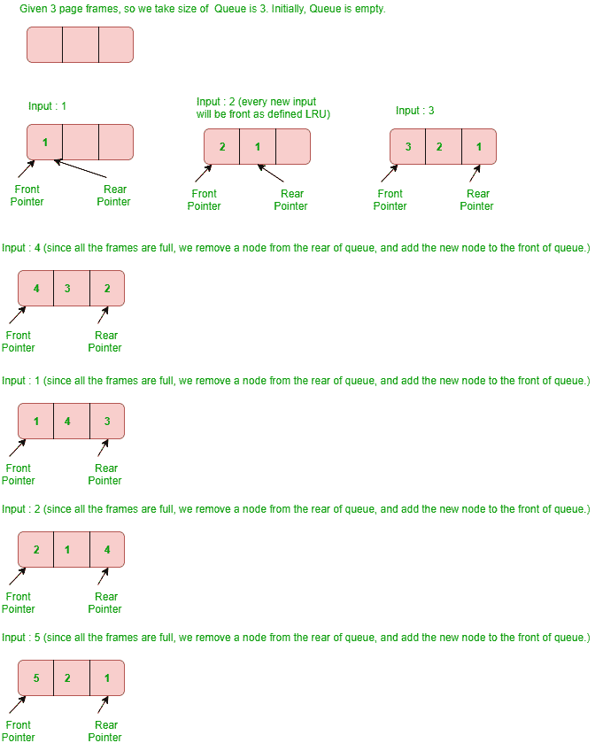
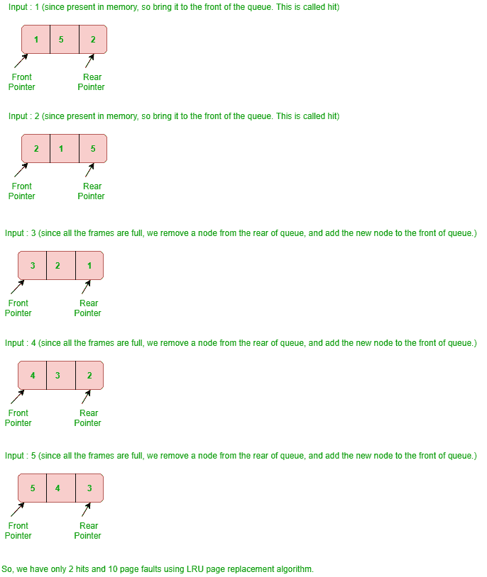

# python–LRU 缓存

> 哎哎哎:# t0]https://www . geeksforgeeks . org/python-LRU cache/

[LRU 缓存](https://www.geeksforgeeks.org/lru-cache-implementation/)是最近使用最少的缓存，基本用于内存组织。在这种情况下，元素以**先进先出格式**出现。我们得到了可以参考的所有可能的页码。我们还会得到缓存(或内存)大小(缓存一次可以容纳的页面帧数)。LRU 缓存方案是在缓存已满并且引用了缓存中不存在的新页面时，删除最近最少使用的帧。LRU 缓存通常使用两个术语，让我们看看它们–

*   **页面命中:**如果在主存储器中找到所需的页面，则它是页面命中。
*   **页面故障:**如果在主存储器中没有找到所需的页面，则发生页面故障。

当引用一个页面时，所需的页面可能在内存中。如果它在内存中，我们需要分离列表的节点，并将其带到队列的前面。
如果需要的页面不在内存中，我们将它带入内存。简而言之，我们在队列的前面添加一个新节点，并在哈希中更新相应的节点地址。如果队列已满，即所有帧都已满，我们将从队列的后面移除一个节点，并将新节点添加到队列的前面。

**示例–**考虑以下参考字符串:

```py
1, 2, 3, 4, 1, 2, 5, 1, 2, 3, 4, 5
```

使用最近最少使用的(LRU)页面替换算法和 3 页框架来查找页面错误的数量。
**解释–**




**LRU 缓存使用 Python**
你可以借助队列实现这个。在本文中，我们使用了使用链表的队列。在 Pycharm IDE 中运行给定的代码。

```py
import time

class Node:

    # Nodes are represented in n
    def __init__(self, key, val):
        self.key = key
        self.val = val
        self.next = None
        self.prev = None

class LRUCache:
    cache_limit = None

    # if the DEBUG is TRUE then it
    # will execute
    DEBUG = False

    def __init__(self, func):
        self.func = func
        self.cache = {}
        self.head = Node(0, 0)
        self.tail = Node(0, 0)
        self.head.next = self.tail
        self.tail.prev = self.head

    def __call__(self, *args, **kwargs):

        # The cache presents with the help
        # of Linked List
        if args in self.cache:
            self.llist(args)

            if self.DEBUG == True:
                return f'Cached...{args}\n{self.cache[args]}\nCache: {self.cache}'
            return self.cache[args]

        # The given cache keeps on moving.
        if self.cache_limit is not None:

            if len(self.cache) > self.cache_limit:
                n = self.head.next
                self._remove(n)
                del self.cache[n.key]

        # Compute and cache and node to see whether 
        # the following element is present or not 
        # based on the given input.
        result = self.func(*args, **kwargs)
        self.cache[args] = result
        node = Node(args, result)
        self._add(node)

        if self.DEBUG == True:
            return f'{result}\nCache: {self.cache}'
        return result

    # Remove from double linked-list - Node.
    def _remove(self, node):
        p = node.prev
        n = node.next
        p.next = n
        n.prev = p

    # Add to double linked-list - Node.
    def _add(self, node):
        p = self.tail.prev
        p.next = node
        self.tail.prev = node
        node.prev = p
        node.next = self.tail

    # Over here the result task is being done 
    def llist(self, args):
        current = self.head

        while True:

            if current.key == args:
                node = current
                self._remove(node)
                self._add(node)

                if self.DEBUG == True:
                    del self.cache[node.key]  
                    self.cache[node.key] = node.val 
                break

            else:
                current = current.next

# Default Debugging is FALSE. For 
# execution of DEBUG is set to TRUE
LRUCache.DEBUG = True

# The DEFAULT test limit is NONE.
LRUCache.cache_limit = 3

@LRUCache
def ex_func_01(n):
    print(f'Computing...{n}')
    time.sleep(1)
    return n

print(f'\nFunction: ex_func_01')
print(ex_func_01(1))
print(ex_func_01(2))
print(ex_func_01(3))
print(ex_func_01(4))
print(ex_func_01(1))
print(ex_func_01(2))
print(ex_func_01(5))
print(ex_func_01(1))
print(ex_func_01(2))
print(ex_func_01(3))
print(ex_func_01(4))
print(ex_func_01(5))
```

**输出:**

```py
Function: ex_func_01
Computing...1
1
Cache: {(1,): 1}
Computing...2
2
Cache: {(1,): 1, (2,): 2}
Computing...3
3
Cache: {(1,): 1, (2,): 2, (3,): 3}
Computing...4
4
Cache: {(1,): 1, (2,): 2, (3,): 3, (4,): 4}
Cached...(1,)
1
Cache: {(2,): 2, (3,): 3, (4,): 4, (1,): 1}
Cached...(2,)
2
Cache: {(3,): 3, (4,): 4, (1,): 1, (2,): 2}
Computing...5
5
Cache: {(4,): 4, (1,): 1, (2,): 2, (5,): 5}
Cached...(1,)
1
Cache: {(4,): 4, (2,): 2, (5,): 5, (1,): 1}
Cached...(2,)
2
Cache: {(4,): 4, (5,): 5, (1,): 1, (2,): 2}
Computing...3
3
Cache: {(5,): 5, (1,): 1, (2,): 2, (3,): 3}
Computing...4
4
Cache: {(1,): 1, (2,): 2, (3,): 3, (4,): 4}
Computing...5
5
Cache: {(2,): 2, (3,): 3, (4,): 4, (5,): 5}
```