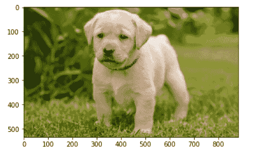
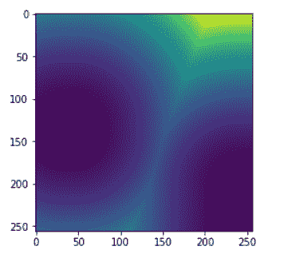

# 蟒蛇 maho tas–简介

> 原文:[https://www.geeksforgeeks.org/python-mahotas-introduction/](https://www.geeksforgeeks.org/python-mahotas-introduction/)

**Mahotas** 是一个针对 Python 的计算机视觉和图像处理与操作库。库是函数和方法的集合，允许您执行许多操作，而不必编写数百行代码。Mahotas 包括许多用数组操作的算法，mahotas 目前有 100 多个图像处理和计算机视觉功能，并且在不断增长。

Mahotas 在寻找图像中的模式方面提供了一个很好的解决方案，例如“Wally 问题在哪里”可以使用 Mahotas 轻松解决。

**如何安装 Mahotas :**

```
pip install mahotas
```

**maho tas 中可用的著名算法:**
1。分水岭
2。凸点计算。
3。命中&未命中，变薄。
4。泽尼克&哈拉利克、LBP 和 TAS 特色。
5。加速鲁棒特征，一种局部特征的形式。
6。阈值。
7。卷积。
8。索贝尔边缘检测。
9。样条插值
10。SLIC 超级像素。

**示例 1:** 加载图像

## 蟒蛇 3

```
# importing required libraries
import numpy as np
import mahotas
import pylab

# loading image
img = mahotas.imread('dog_image.png')

# showing the original image
imshow(img)
show()
```

**输出:**



**示例 2:** 创建距离变换

## 蟒蛇 3

```
# importing required libraries
import pylab as p
import numpy as np
import mahotas

# creating numpy array of type bool
f = np.ones((256, 256), bool)

# setting false values
f[200:, 240:] = False
f[128:144, 32:48] = False

# f is basically True with the exception of two islands:
# one in the lower-right
# corner, another, middle-left

# creating a distance using numpy array
dmap = mahotas.distance(f)

# showing image
p.imshow(dmap)
p.show()
```

**输出:**

