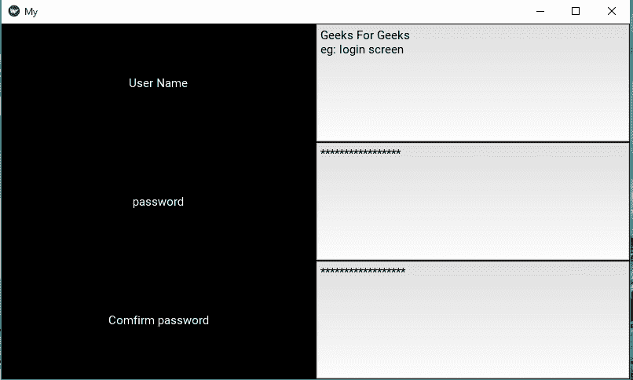
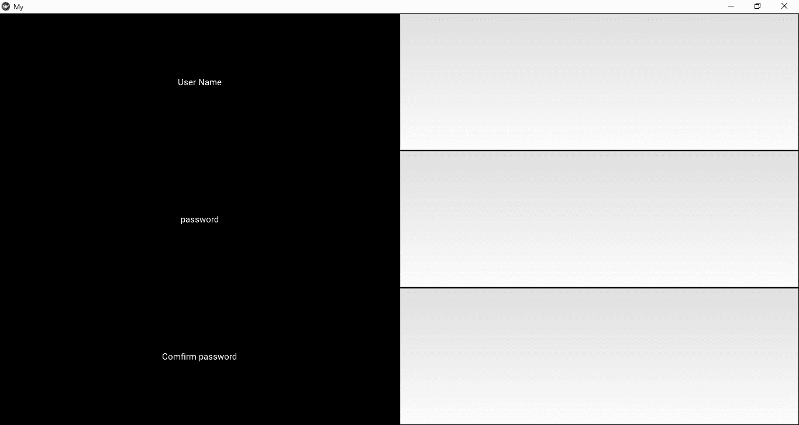
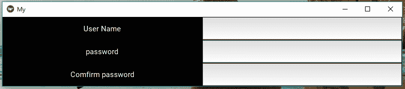

# Python |使用 kivy

制作一个简单的窗口

> 原文:[https://www . geesforgeks . org/python-make-a-simple-window-use-kivy/](https://www.geeksforgeeks.org/python-make-a-simple-window-using-kivy/)

Kivy 是一个独立的平台，因为它可以在安卓、IOS、linux 和视窗等平台上运行。Kivy 为您提供了一次性编写代码并在不同平台上运行的功能。它基本上是用来开发安卓应用程序的，但并不意味着它不能在桌面应用程序上使用。
使用此命令安装 kivy:

```
pip install kivy
```

现在在本文中，我们将讨论如何在 kivy 中构建一个窗口，就像一个登录屏幕，它能够从用户那里获取用户名和密码，而没有功能只是布局。

> ？？？？？？？？ [Kivy 教程–通过示例学习 Kivy](https://www.geeksforgeeks.org/kivy-tutorial/)。

为了制作登录页面，我们首先必须导入 kivy 的一些特性——小部件、网格布局。

## 蟒蛇 3

```
# base Class of your App inherits from the App class.
from kivy.app import App
# GridLayout arranges children in a matrix.
from kivy.uix.gridlayout import GridLayout
# Label is used to label something
from kivy.uix.label import Label
# used to take input from users
from kivy.uix.textinput import TextInput

class LoginScreen(GridLayout):
    def __init__(self, **var_args):

        super(LoginScreen, self).__init__(**var_args)
        # super function can be used to gain access
        # to inherited methods from a parent or sibling class
        # that has been overwritten in a class object.
        self.cols = 2     # You can change it accordingly
        self.add_widget(Label(text ='User Name'))
        self.username = TextInput(multiline = True)

        # multiline is used to take
        # multiline input if it is true
        self.add_widget(self.username)
        self.add_widget(Label(text ='password'))
        self.password = TextInput(password = True, multiline = False)

        # password true is used to hide it
        # by * self.add_widget(self.password)
        self.add_widget(Label(text ='Comfirm password'))
        self.password = TextInput(password = True, multiline = False)
        self.add_widget(self.password)

# the Base Class of our Kivy App
class MyApp(App):
    def build(self):
        # return a LoginScreen() as a root widget
        return LoginScreen()

if __name__ == '__main__':
    MyApp().run()
```

**输出:**



**代码解释:**
**类登录屏幕(GridLayout) :**

*   在这堂课中，我们制作了像用户名、密码这样的网格和块，并提供了文本输入的功能。现在让我们来看看详细的描述。
    在 LoginScreen 类中，我们覆盖方法 __init__()以便添加小部件并定义它们的行为。

## 蟒蛇 3

```
def __init__(self, **kwargs):
super(LoginScreen, self).__init__(**kwargs)
```

*   人们不应该忘记调用 super 来实现被
    重载的原始类的功能。还要注意的是，在调用 super 时不要省略* * kwargs 是一个很好的做法，因为它们有时会在内部使用。
*   我们要求网格布局在两列中管理其子节点，并为
    用户名和密码添加一个标签和一个文本输入。

## 计算机编程语言

```
self.cols = 2
self.add_widget(Label(text='User Name'))
self.username = TextInput(multiline=False)
self.add_widget(self.username)

self.add_widget(Label(text='password'))
self.password = TextInput(password=True, multiline=False)
self.add_widget(self.password)
```

**级 MyApp :**

*   该类源自 *kivy.app* 的 App()类。这个类是运行 kivy 应用程序的基类。它基本上是 kivy run 循环的主要入口点。
    在大多数情况下，我们子类化这个类，并制作自己的 App。我们创建特定 App()类的实例，当我们准备启动时，我们调用实例 App()。run()方法。
    这里的 build()方法“初始化应用程序；它只会被调用一次。如果此方法返回一个小部件(树)，它将被用作根小部件并添加到窗口中。
    返回:无或根小部件实例，如果不存在 *self.root*
*   **MyApp.run()** 是 run()方法，在独立模式下启动应用程序，并调用 MyApp 类，该类返回 Loginscreen()类。

最好的部分是，尝试重新调整窗口大小，您将看到屏幕上的小部件会根据窗口的大小进行自我调整，因为默认情况下小部件使用大小提示(调整)。
例如:



