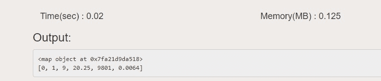
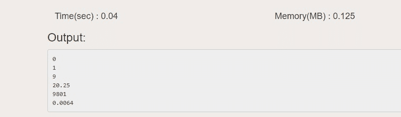

# Python:地图 VS For Loop

> 原文:[https://www.geeksforgeeks.org/python-map-vs-for-loop/](https://www.geeksforgeeks.org/python-map-vs-for-loop/)

**Python 中的地图:**

*   Map 用于计算单行代码“”中不同值*的函数。*
*   它需要两个参数，第一个是已经定义的函数名，另一个是 list、tuple 或任何其他 iterables。
*   这是对多个数字应用相同函数的一种方式。
*   它在特定位置生成地图对象。
*   当我们在元素上调用一个已经定义的函数时，它工作得很快
*   ```py
     map(functionname, iterable)
    ```

**注意:**更多信息参考 [Python 图()函数](https://www.geeksforgeeks.org/python-map-function/)。

Python 中循环的**:**

*   我们使用 for 循环将一个代码块重复固定的次数。
*   当不需要结果时使用。
*   执行顺序遍历。
*   从 0 到 n 的循环运行 n+1 次。
*   ```py
     for var in iterable :
                   statements 
    ```

    **注意:**这里 var 是迭代变量的名称，iterable 可以用 range()函数代替，它们可以是任何数据类型。语句是要执行的操作步骤。

**注意:**更多信息请参考 [Python For Loops](https://www.geeksforgeeks.org/python-for-loops/) 。

**例:**

## 计算机编程语言

```py
# function to square a given number
def squareNum (a) :
    return a * a

listt = [0, -1, 3, 4.5, 99, .08]

# using 'map' to call the function
# 'squareNum' for all the elements
# of 'listt'
x = map(squareNum, listt)

# map function returns a map
# object at this particular 
# location
print(x) 

# convert map to list
print(list(x)) 

# alternate way to square all
# elements of 'listt' using
# 'for loop'

for i in listt :
    square = i * i
    print(square)
```

**输出:**

```py
<map object at 0x7fe413cf9b00>
[0, 1, 9, 20.25, 9801, 0.0064]
0
1
9
20.25
9801
0.0064

```

#### 环路映射 vs

1.  Comparing performance , map() wins! map() works way faster than for loop. Considering the same code above when run in [this ide](https://ide.geeksforgeeks.org/index.php).

    **使用地图():**

    

    **用于循环:**

    

2.  for loop can be with no content, no such concept exist in map() function.

    **例:**

    ## 计算机编程语言

    ```py
    # we use the keyword 'pass'
    # to simply get a for loop 
    # with no content
    for i in range (10) :
        pass
    ```

3.  There can be an `else` condition in `for` loop which only runs when no `break` statement is used. There is nothing like this in `map`.

    **例:**

    ## 计算机编程语言

    ```py
    # for loop with else condition

    for i in range(10) :
        print(i)
    else : 
        print("Finished !")
    ```

    **输出:**

    ```py
    0
    1
    2
    3
    4
    5
    6
    7
    8
    9
    Finished !

    ```

4.  for 循环也可以在之前退出。我们可以使用`break`语句来做到这一点。在映射中不可能在预期之前退出。
5.  map 生成一个 map 对象，for 循环不返回任何内容。
6.  map 和 for 循环的语法完全不同。
7.  for 循环用于固定次数地执行同一个代码块，map 也是这样做的，但是在一行代码中。