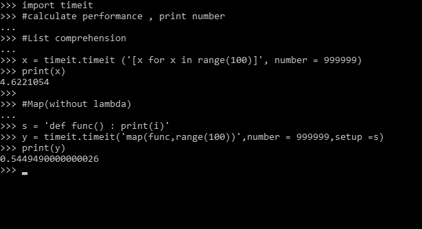
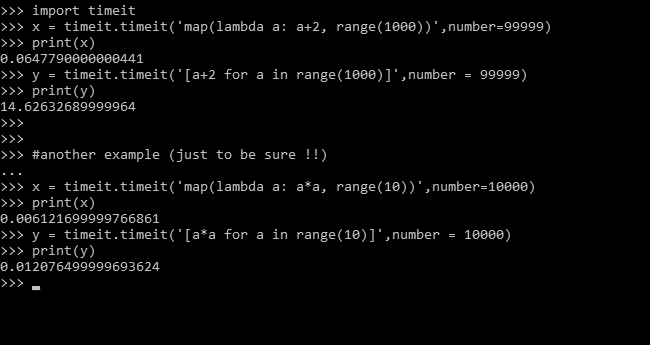

# Python–地图与列表理解

> 原文:[https://www . geesforgeks . org/python-map-vs-list-understance/](https://www.geeksforgeeks.org/python-map-vs-list-comprehension/)

假设我们有一个函数，我们想在一行代码中为不同的值计算这个函数。这就是 ****[地图()](https://www.geeksforgeeks.org/python-map-function/)**** 功能发挥作用的地方！`map()`函数将给定函数应用于给定可迭代表(列表、元组等)的每个项目后，返回结果的映射对象(迭代器)。)

> **语法:**映射(funcname，iterables)
> 
> **参数:**
> 
> **funcname:** 是已经定义的函数的名称，要为每个项目执行。
> **可迭代对象:**可以是列表、元组或任何其他可迭代对象。
> 
> **返回类型:**将给定函数应用于给定 iterable(列表、元组等)的每个项目后，返回一个 map 对象。)

**示例:**

```py
# function to double the number
def num (n) :
    return n * 2

lst = [2, 44, 5.5, 6, -7]

# suppose we want to call function
# 'num' for each element of lst,
# we use map

# creates a map object
x = map(num, lst) 
print(x) 

# returns list
print(list(x))  
```

**输出:**

```py
<map object at 0x7f859f3f05c0>
[4, 88, 11.0, 12, -14]

```

**注意:**更多信息请参考 [Python 地图()函数](https://www.geeksforgeeks.org/python-map-function/)。

**列表理解**是 lambda 函数的替代品，`map()`、`filter()`和`reduce()`。它遵循数学集合生成器符号的形式。它提供了一种创建列表的简洁方法。

**语法:**

```py
[ expression for item in list if conditional ]

```

**参数:**

*   **表达式–**基于每个元素使用的变量
*   **为..in–**“for”后跟要使用的变量名，后跟“in”
*   **if–**进行过滤

**示例:**

```py
lst = [2, 44, 5.5, 6, -7]

# to double the number
# list comprehension
x = [i * 2 for i in lst ] 
print(x)
```

**输出:**

```py
[4, 88, 11.0, 12, -14]

```

**注意:**更多信息请参考 [Python 列表理解与切片](https://www.geeksforgeeks.org/python-list-comprehension-and-slicing/)。

#### 地图 VS 列表理解

*   与地图相比，列表理解更简洁，更容易阅读。
*   列表理解允许过滤。在地图上，我们没有这样的设施。比如要打印 100 范围内的所有偶数，可以写`[n for n in range(100) if n%2 == 0]`。地图上没有它的替代物
*   当需要结果列表时，使用列表理解，因为 map 只返回 map 对象，不返回任何列表。
*   当我们需要评估太长或太复杂而无法表达的表达时，列表理解比映射更快
*   Map is faster in case of calling an already defined function (as no lambda is required).

    #### 比较执行时间

    **注意:**我们将使用内置的 python 库“`timeit`”。

    *   **Without lambda**

        让我们做一个简单的操作来打印给定范围内的数字。我们使用地图和列表理解一个接一个地执行这个操作。

        
        从上面的例子中，我们可以得出结论，当已经定义了一个函数时，map 的表现优于 list 的理解。

    *   **With lambda in map**
        Let us take operations where we require a lambda inside the map(). The first operation is to add 2 to every number in the given range. Second operation is to square every number in the given range.
        

        从上面的代码中，我们可以观察到 map 仍然比 list 的理解效果更好。

        **注:**有些情况下列表理解比 map 表现更好，此时表达式太长太复杂。