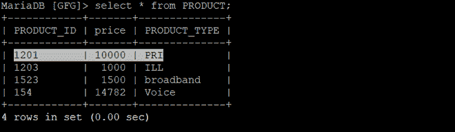
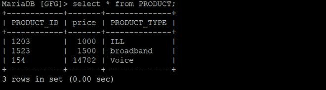
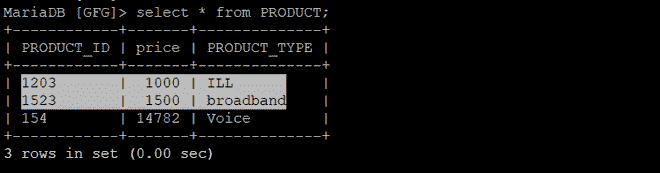
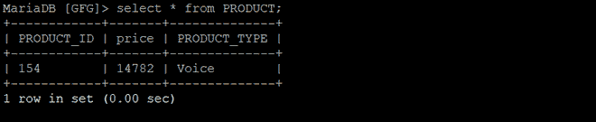

# Python Mariadb–使用 PyMySQL 删除查询

> 原文:[https://www . geesforgeks . org/python-Maria db-delete-query-using-pymysql/](https://www.geeksforgeeks.org/python-mariadb-delete-query-using-pymysql/)

删除是一个 SQL 查询，用于从具有给定条件的表中删除一个或多个条目。要用 Python 连接 **MariaDB** 数据库服务器，需要导入 **pymysql** 客户端。在 MySQL 中与数据库连接后，我们可以在其中创建表并对它们进行操作。

**语法:**

```py
DELETE FROM TABLE_NAME WHERE ATTRIBUTE_NAME = ATTRIBUTE_VALUE

```

**示例 1:** 下面是一个从数据库的表中删除查询的程序。

## 蟒蛇 3

```py
import pymysql

# Create a connection object
# IP address of the MySQL database server
Host = "localhost"  

# User name of the database server
User = "user"       

# Password for the database user
Password = ""           

database = "GFG"

conn  = pymysql.connect(host=Host, user=User, 
                        password=Password, database)

# Create a cursor object
cur  = conn.cursor()

query = f"DELETE FROM PRODUCT WHERE PRODUCT_TYPE = 'PRI'"

cur.execute(query)

# To commit the changes
conn.commit() 
conn.close()
```

**输出:**

**在**之前T3 之后

在上面的程序中，从表“产品”中删除了一个查询，该查询具有**产品类型**属性值**优先级**。

**示例 2:** 让我们看看表中查询的另一个示例。

## 蟒蛇 3

```py
import pymysql

# Create a connection object
conn  = pymysql.connect('localhost', 'user',
                        'password', 'database')

# Create a cursor object
cur  = conn.cursor()

query = f"DELETE FROM PRODUCT WHERE price < 2000"

cur.execute(query)

# To commit the changes
conn.commit()       
conn.close()
```

**输出:**

**在**之前T3 之后

在上面的程序中，从 PRODUCT 表中删除了一个查询，该表中的**价格**低于 **2000** 。