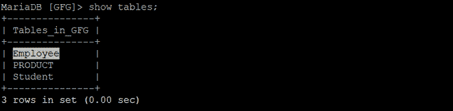
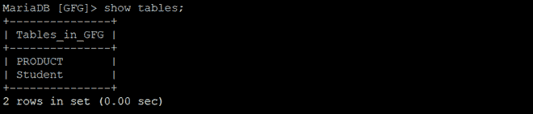
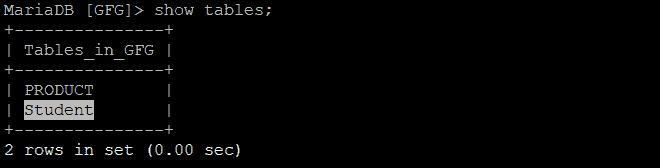
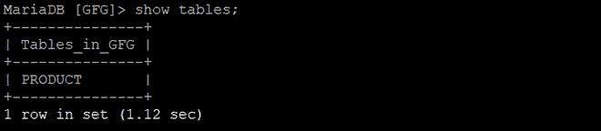

# Python Mariadb–使用 PyMySQL 删除表

> 原文:[https://www . geesforgeks . org/python-mariadb-drop-table-using-pymysql/](https://www.geeksforgeeks.org/python-mariadb-drop-table-using-pymysql/)

**马里亚数据库**是一个开源数据库管理系统和它的前身 MySQL。可以使用 **pymysql 客户端**与 MariaDB 进行交互，类似于使用 Python 的 mysql。

在本文中，我们将研究使用 *pymysql* 从数据库中删除表的过程。要删除表，请使用以下任何语法:

**语法:**

```
DROP TABLE tablename;

DROP TABLE IF EXISTS tablename;

```

以下程序将帮助您更好地理解这一点。

**例 1 :**

程序演示掉落是否存在。我们将尝试删除上述数据库中不存在的表。

## 蟒蛇 3

```
import pymysql

# Create a connection object
# IP address of the MySQL database server
Host = "localhost"  

# User name of the database server
User = "user"      

# Password for the database user
Password = ""           

database = "GFG"

conn  = pymysql.connect(host=Host, user=User, password=Password, database)

# Create a cursor object
cur  = conn.cursor()

query = f"DROP TABLE IF exists Employee"

cur.execute(query)

conn.close()
```

**输出:**

*   以前



*   在...之后



**例 2 :**

这里我们将放下*学生*表。

## 蟒蛇 3

```
import pymysql

# Create a connection object

conn  = pymysql.connect('localhost', 'user', 'password', 'database')

# Create a cursor object
cur  = conn.cursor()

query = f"DROP TABLE IF exists Student"

cur.execute(query)

rows = cur.fetchall()
conn.close()

for row in rows :
    print(row)
```

**输出:**

*   以前



*   在...之后

