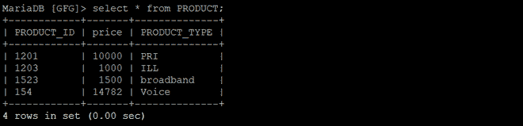

# Python 马里亚数据库–使用 PyMySQL 插入表格

> 原文:[https://www . geesforgeks . org/python-Maria db-insert-in-table-using-pymysql/](https://www.geeksforgeeks.org/python-mariadb-insert-into-table-using-pymysql/)

**马里亚数据库**是一个开源数据库管理系统和它的前身 MySQL。可以使用 **pymysql 客户端**与 MariaDB 进行交互，类似于使用 Python 的 mysql。

在本文中，我们将研究使用 *pymysql* 向数据库的表中插入行的过程。可以一次插入一行或多行。将命令连接到特定数据库需要连接器代码。要插入数据，请使用以下语法:

```
Syntax: INSERT INTO table_name column1, column2 VALUES (value1, value2)
```

**注意:****INSERT**查询用于在表格中插入一行或多行。

**示例:**

在 PRODUCT 表中插入一行。

## 蟒蛇 3

```
# import the mysql client for python

import pymysql

# Create a connection object
# IP address of the MySQL database server
Host = "localhost"  
# User name of the database server
User = "user"       
# Password for the database user
Password = ""           

database = "database_name"

conn  = pymysql.connect(host=Host, user=User, password=Password, database)

# Create a cursor object
cur  = conn.cursor()

PRODUCT_ID = '1201'
price = 10000
PRODUCT_TYPE = 'PRI'

query = f"INSERT INTO PRODUCT (PRODUCT_ID, price,PRODUCT_TYPE) VALUES ('{PRODUCT_ID}', '{price}', '{PRODUCT_TYPE}')"

cur.execute(query)
print(f"{cur.rowcount} details inserted")
conn.commit()
conn.close()
```

**输出:**

 

要一次插入多个值，请使用***executemy()方法*** 。此方法遍历参数序列，将当前参数传递给执行方法。

**示例:**

在 PRODUCT 表中插入多行。

## 蟒蛇 3

```
query = "INSERT INTO PRODUCT (PRODUCT_ID, price,PRODUCT_TYPE) VALUES ('%s', %d, '%s')"

values = [("1203",1000,"ILL"),
          ("1523",1500,"broadband"),
          ("154",14782,"Voice"),
        ]
cur.execute(query,values)
print(f"{cur.rowcount}, details inserted")
conn.commit()
conn.close()
```

**输出:**

 

**注:**

*   使用**光标()**来遍历行。
*   如果没有 conn.commit()命令，将不会保存更改。