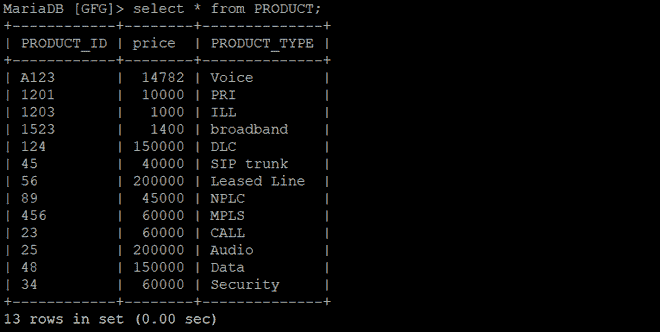
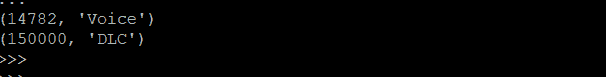
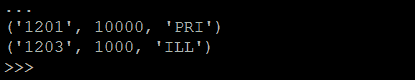

# Python Mariadb–使用 PyMySQL 的限制条款

> 原文:[https://www . geesforgeks . org/python-Maria db-limit-子句-use-pymysql/](https://www.geeksforgeeks.org/python-mariadb-limit-clause-using-pymysql/)

在 SQL 中，Limit 子句用于控制或限制从生成的查询返回的结果集中的记录数。默认情况下，SQL 从顶部开始给出所需的记录数，但它允许使用 OFFSET 关键字。OFFSET 允许您从一个自定义行开始，并获得所需数量的结果行。

**语法:**

```
SELECT * FROM tablename LIMIT limit;
SELECT * FROM tablename LIMIT limit OFFSET offset;

```

以下程序将帮助您更好地理解这一点。

**正在使用的数据库:**



**示例 1:** 仅显示 2 条记录的程序

## 蟒蛇 3

```
import pymysql

# Create a connection object
# IP address of the MySQL database server
Host = "localhost"  

# User name of the database server
User = "user"       

# Password for the database user
Password = ""           

database = "GFG"

conn  = pymysql.connect(host=Host, user=User, password=Password, database)

# Create a cursor object
cur  = conn.cursor()

query = f"SELECT price,PRODUCT_TYPE FROM PRODUCT WHERE price > 10000 LIMIT 2"

cur.execute(query)

rows = cur.fetchall()
for row in rows :
    print(row)

conn.close()
```

**输出:**



**例 2:** 从第二条记录开始编程，显示前两条记录

## 蟒蛇 3

```
import pymysql

# Create a connection object
conn  = pymysql.connect('localhost', 'user', 'password', 'database')

# Create a cursor object
cur  = conn.cursor()

query = f"SELECT * FROM PRODUCT LIMIT 2 OFFSET 1"

cur.execute(query)

rows = cur.fetchall()
for row in rows :
    print(row)

conn.close()
```

**输出:**

