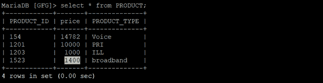
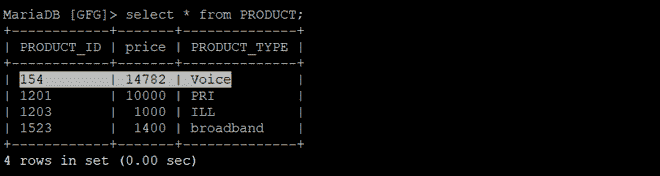
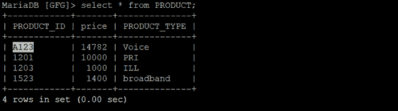

# Python Mariadb–使用 PyMySQL 更新查询

> 原文:[https://www . geesforgeks . org/python-Maria db-update-query-use-pymysql/](https://www.geeksforgeeks.org/python-mariadb-update-query-using-pymysql/)

**马里亚数据库**是一个开源的数据库管理系统和它的前身 MySQL。可以使用 **pymysql 客户端**与 MariaDB 进行交互，类似于使用 Python 的 mysql。

在本文、中，我们将研究使用 *pymysql* 对数据库的一个表使用 UPDATE 查询的过程。更新用于更改数据库中的现有值。通过使用 update 语句，可以更正或更新特定的值。它只影响数据，不影响表的结构。该命令提供的基本优势是它可以保持表格的准确性。

**语法:**

```
UPDATE tablename
SET column_nmae = "new value"
WHERE conditions;

```

以下程序将帮助您更好地理解这一点。

**例 1 :**

## 蟒蛇 3

```
import pymysql

# Create a connection object
# IP address of the MySQL database server
Host = "localhost"  

# User name of the database server
User = "user"       

# Password for the database user
Password = ""           

database = "GFG"

conn  = pymysql.connect(host=Host, user=User, password=Password, database)

# Create a cursor object
cur  = conn.cursor()

query = f"UPDATE PRODUCT SET price = 1400 WHERE PRODUCT_TYPE = 'broadband'"

cur.execute(query)

#To commit the changes
conn.commit() 
conn.close()
```

**输出:**

**前:** 
**后:** 

在上面的程序中，我们将**宽带**价格从 1200 更新为 1400。

**例 2 :**

## 蟒蛇 3

```
import pymysql

# Create a connection object
conn  = pymysql.connect('localhost', 'user',
                        'password', 'database')

# Create a cursor object
cur  = conn.cursor()

query = f"update PRODUCT set PRODUCT_ID = 'A123' WHERE \
price = 14782 AND PRODUCT_TYPE = 'Voice'"

cur.execute(query)

# To commit the changes
conn.commit()       
conn.close()
```

**输出:**

**前** 
**后**


在上述程序中，我们将产品标识更新为 **A123** ，其中**价格= 14782** 和**产品类型=“语音”。**