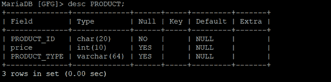
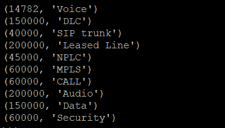
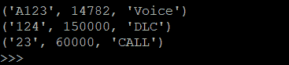

# Python 马里亚数据库–使用 PyMySQL 的 Where 子句

> 原文:[https://www . geesforgeks . org/python-mariadb-where-子句-using-pymysql/](https://www.geeksforgeeks.org/python-mariadb-where-clause-using-pymysql/)

在**马里亚数据库**中使用 Where 子句，根据需要的条件过滤数据。您可以使用 where 子句获取、删除或更新**马里亚数据库**中的特定数据集。

**语法:**

```
SELECT column1, column2, …. cloumnN FROM [TABLE NAME] WHERE [CONDITION];

```

上面的语法用于显示符合条件的特定数据集。

**示例 1:** 考虑以下名为 **GFG** 的数据库，其表名为**产品**。

**表的模式:**



**表数据:**


**Python 中的 Where 子句:**

在 Python 中使用 where 子句的步骤是:

1.  首先在**马里亚数据库**和 Python 程序之间形成连接。这是通过导入 **pymysql** 包并使用 **pymysql.connect()** 方法来完成的，用于将用户名、密码、主机(可选默认值:localhost)和数据库(可选)作为参数传递给它。
2.  现在，使用**光标()**方法在上面创建的连接对象上创建一个光标对象。数据库游标是一种控制结构，可以遍历数据库中的记录。
3.  然后，通过 **execute()** 方法传递 where 子句语句来执行该语句。

## 蟒蛇 3

```
import pymysql

# Create a connection object
# IP address of the MySQL database server
Host = "localhost"  

# User name of the database server
User = "user"       

# Password for the database user
Password = ""           

database = "GFG"

conn  = pymysql.connect(host=Host, user=User, password=Password, database)

# Create a cursor object
cur  = conn.cursor()

query = f"SELECT price,PRODUCT_TYPE FROM PRODUCT WHERE price > 10000"

cur.execute(query)

rows = cur.fetchall()
for row in rows :
    print(row)

conn.close()
```

**输出:**



**例 2 :**

## 蟒蛇 3

```
import pymysql

# Create a connection object

conn  = pymysql.connect('localhost', 'user', 'password', 'database')

# Create a cursor object
cur  = conn.cursor()

query = f"SELECT * FROM PRODUCT WHERE PRODUCT_TYPE in ('Voice','DLC','CALL')"

cur.execute(query)

rows = cur.fetchall()
for row in rows :
    print(row)

conn.close()
```

**输出:**

