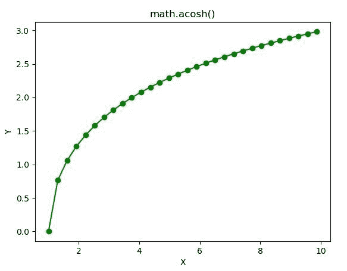

# Python–math . acosh()函数

> 原文:[https://www.geeksforgeeks.org/python-math-acosh-function/](https://www.geeksforgeeks.org/python-math-acosh-function/)

**数学模块**包含许多用于数学运算的函数。函数的作用是:返回一个数字的双曲余弦值。在此函数中传递的值应该是大于或等于 1 的**。**

> ****语法:** math.acosh(x)**
> 
> ****参数:**此方法只接受单个参数。**
> 
>  ***   **x :** 此参数是要传递给 acosh()的值
> 
> **返回:**这个函数返回一个数的双曲弧余弦值。**

**下面的例子说明了上述功能的使用:**

****例 1:****

```
# Python code to implement
# the acosh()function

# importing "math"
# for mathematical operations  
import math  

a = math.pi / 6

# Return the hyperbolic arc cosine value of numbers 
print (math.acosh(7))
print (math.acosh(56))
print (math.acosh(2.45))
print (math.acosh(1))
```

****输出:****

```
2.6339157938496336
4.718419142372879
1.5447131178707394
0.0 
```

****例 2:****

```
# Python code implementation of 
# the acosh() function
import math 
import numpy as np 
import matplotlib.pyplot as plt  

in_array = np.linspace(1, np.pi**2, 30) 

out_array = [] 

for i in range(len(in_array)): 
    out_array.append(math.acosh(in_array[i])) 
    i += 1

print("Input_Array : \n", in_array)  
print("\nOutput_Array : \n", out_array)  

plt.plot(in_array, out_array, "go-")  
plt.title("math.acosh()")  
plt.xlabel("X")  
plt.ylabel("Y")  
plt.show() 
```

****输出:****

```
Input_Array : 
 [1\.         1.30584843 1.61169686 1.91754528 2.22339371 2.52924214
 2.83509057 3.14093899 3.44678742 3.75263585 4.05848428 4.3643327
 4.67018113 4.97602956 5.28187799 5.58772641 5.89357484 6.19942327
 6.5052717  6.81112012 7.11696855 7.42281698 7.72866541 8.03451384
 8.34036226 8.64621069 8.95205912 9.25790755 9.56375597 9.8696044 ]

Output_Array : 
 [0.0, 0.7634351653684978, 1.0562772501126303, 1.2679873925813194, 1.4372757745859863, 
1.5794735761470122, 1.7025573669627803, 1.8113067645313763, 1.9088495232436826,
1.997360544554533, 2.07842113836573, 2.1532211217708626, 2.2226804635542514, 
2.287526464855001, 2.348344844358015, 2.405614746886384, 2.4597334430301796, 
2.51103419200721, 2.559799438447933, 2.6062707446710016, 2.6506563890658725, 
2.693137263795659, 2.7338715120762482, 2.7729982170653664, 2.8106403673544613, 
2.8469072638299315, 2.8818964902724367, 2.9156955397451294, 2.9483831668303044, 
2.9800305196125625] 
```

****