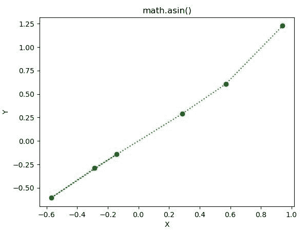

# Python–math . asin()函数

> 原文:[https://www.geeksforgeeks.org/python-math-asin-function/](https://www.geeksforgeeks.org/python-math-asin-function/)

**数学模块**包含许多用于数学运算的函数。 **math.asin()** 函数返回一个数字的反正弦值。在此函数中传递的值应该是介于-1 到 1 之间的**。**

> ****语法:** math.asin(x)**
> 
> ****参数:**此方法只接受单个参数。**
> 
>  ***   **x :** 此参数是要传递给 asin()的值
> 
> **返回:**该函数返回一个数的反正弦值。**

**下面的例子说明了上述功能的使用:**

****例 1:****

```
# Python code to implement
# the acos()function

# importing "math"
# for mathematical operations  
import math  

a = math.pi / 6

# returning the value of arc sine of pi / 6  
print ("The value of arc sine of pi / 6 is : ", end ="")  
print (math.asin(a))
```

****输出:****

```
The value of arc sine of pi / 6 is : 0.5510695830994463 
```

****例 2:****

```
# Python code to implement
# the aasin()function
import math 
import matplotlib.pyplot as plt  

in_array = [-0.14159265, -0.57039399, -0.28559933, 
            0.28559933, 0.57039399,  0.94159265] 

out_array = [] 

for i in range(len(in_array)): 
    out_array.append(math.asin(in_array[i])) 
    i += 1

print("Input_Array : \n", in_array)  
print("\nOutput_Array : \n", out_array)    

plt.plot(in_array, out_array, "go:")  
plt.title("math.asin()")  
plt.xlabel("X")  
plt.ylabel("Y")  
plt.show()  
```

****输出:****

```
Input_Array : 
 [-0.14159265, -0.57039399, -0.28559933, 0.28559933, 0.57039399, 0.94159265]

Output_Array : 
 [-0.14207008957392517, -0.6069854488522558, -0.2896317474780172, 0.2896317474780172, 0.6069854488522558, 1.227328875116741] 
```

****