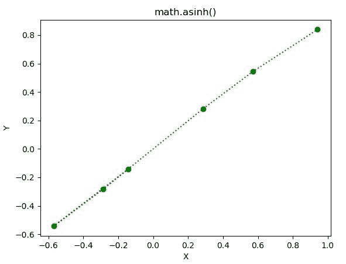

# Python–math . asinh()函数

> 原文:[https://www.geeksforgeeks.org/python-math-asinh-function/](https://www.geeksforgeeks.org/python-math-asinh-function/)

**数学模块**包含许多用于数学运算的函数。函数的作用是:返回一个数字的双曲正弦值。

> **语法:**数学. asinh(x)
> 
> **参数:**此方法只接受单个参数。
> 
> *   **x :** 此参数是要传递给 asinh()的值
> 
> **返回:**该函数返回一个数的双曲弧正弦值。

下面的例子说明了上述功能的使用:

**例 1:**

```py
# Python code to implement
# the asinh()function

# importing "math"
# for mathematical operations  
import math  

# Return the hyperbolic arc sine value of numbers 
print (math.asinh(17))
print (math.asinh(5.6))
print (math.asinh(245))
print (math.asinh(-3445))
```

**输出:**

```py
3.5272244561999657
2.4237920435875173
6.194409556009931
-8.837826385072708

```

**例 2:**

```py
# Python code to implement
# the aasinh()function
import math 
import matplotlib.pyplot as plt  

in_array = [-0.14159265, -0.57039399, -0.28559933, 
            0.28559933, 0.57039399,  0.94159265] 

out_array = [] 

for i in range(len(in_array)): 
    out_array.append(math.asinh(in_array[i])) 
    i += 1

print("Input_Array : \n", in_array)  
print("\nOutput_Array : \n", out_array)   

plt.plot(in_array, out_array, "go:")  
plt.title("math.asinh()")  
plt.xlabel("X")  
plt.ylabel("Y")  
plt.show()  
```

**输出:**

```py
Input_Array : 
 [-0.14159265, -0.57039399, -0.28559933, 0.28559933, 0.57039399, 0.94159265]

Output_Array : 
 [-0.14112374861052449, -0.5432727660031201, -0.28185270483975433, 0.28185270483975433, 0.5432727660031201, 0.8394645626112472]

```

