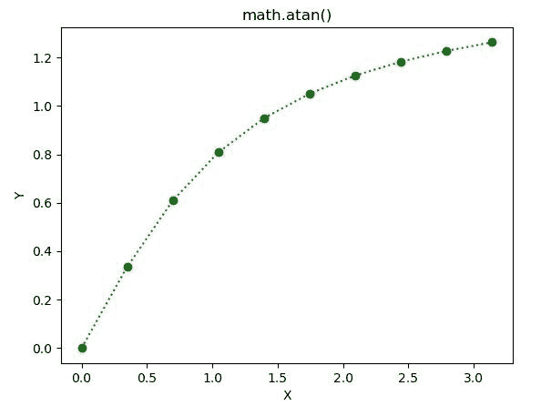

# Python–math . atan()函数

> 原文:[https://www.geeksforgeeks.org/python-math-atan-function/](https://www.geeksforgeeks.org/python-math-atan-function/)

**数学模块**包含许多用于数学运算的函数。函数的作用是:返回一个数值的反正切值。在此函数中传递的值应该是在-PI/2 和 PI/2 弧度之间的**。**

> **语法:** math.atan(x)
> 
> **参数:**此方法只接受单个参数。
> 
> *   **x :** 此参数是要传递给 atan()的值
> 
> **返回:**这个函数返回一个数值的反正切值。

下面的例子说明了上述功能的使用:

**例 1:**

```
# Python code to implement
# the atan()function

# importing "math"
# for mathematical operations  
import math   

a = math.pi / 6

# returning the value of arctangent  of pi / 6  
print ("The value of tangent of pi / 6 is : ", end ="")  
print (math.atan(a))  
```

**输出:**

```
The value of tangent of pi / 6 is : 0.48234790710102493

```

**例 2:**

```
# Python code to implement
# the atan()function
import math 
import numpy as np 
import matplotlib.pyplot as plt  

in_array = np.linspace(0, np.pi, 10)  

out_array = [] 

for i in range(len(in_array)): 
    out_array.append(math.atan(in_array[i])) 
    i += 1

print("Input_Array : \n", in_array)  
print("\nOutput_Array : \n", out_array)   

plt.plot(in_array, out_array, "go:")  
plt.title("math.atan()")  
plt.xlabel("X")  
plt.ylabel("Y")  
plt.show()  
```

**输出:**

```
Input_Array : 
 [0\.         0.34906585 0.6981317  1.04719755 1.3962634  1.74532925
 2.0943951  2.44346095 2.7925268  3.14159265]

Output_Array : 
 [0.0, 0.3358423725664079, 0.6094709714274295, 0.808448792630022, 0.9492822422213403, 1.0504981725497873, 1.1253388328842984, 1.1823365638628716, 1.2269249964859286, 1.2626272556789118]

```

