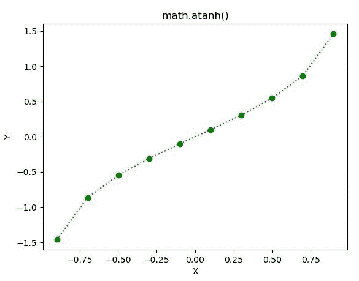

# Python–math . atanh()函数

> 原文:[https://www.geeksforgeeks.org/python-math-atanh-function/](https://www.geeksforgeeks.org/python-math-atanh-function/)

**数学模块**包含许多用于数学运算的函数。函数的作用是:返回一个数字的双曲反正切值。在此函数中传递的值应该是介于-0.99 到 0.99 之间的**。**

> ****语法:** math.atanh(x)**
> 
> ****参数:**此方法只接受单个参数。**
> 
>  ***   **x :** 此参数是要传递给 atanh()的值
> 
> **返回:**这个函数返回一个数字的双曲反正切值。**

**下面的例子说明了上述功能的使用:**

****例 1:****

```
# Python code to implement
# the atanh()function

# importing "math"
# for mathematical operations  
import math   

# Return the hyperbolic arctangent of numbers 
print (math.asinh(0.17))
print (math.asinh(0.56))
print (math.asinh(0.245))
print (math.asinh(-0.3445))  
```

****输出:****

```
0.1691916359351954
0.5342240739536623
0.24261291139707475
-0.33802589861247084 
```

****例 2:****

```
# Python code to implement
# the atanh()function
import math 
import numpy as np 
import matplotlib.pyplot as plt  

in_array = np.linspace(-np.pi / 3.5, np.pi / 3.5, 10)  

print("Input_Array : \n", in_array)

out_array = [] 

for i in range(len(in_array)): 
    out_array.append(math.atanh(in_array[i])) 
    i += 1

print("\nOutput_Array : \n", out_array)   

plt.plot(in_array, out_array, "go:")  
plt.title("math.atanh()")  
plt.xlabel("X")  
plt.ylabel("Y")  
plt.show()  
```

****输出:****

```
Input_Array : 
 [-0.8975979 -0.6981317 -0.4986655 -0.2991993 -0.0997331  0.0997331
  0.2991993  0.4986655  0.6981317  0.8975979]

Output_Array : 
 [-1.459718446245292, -0.8636465496349238, -0.547528391492765, -0.30863994644251713, -0.10006575914805733, 0.10006575914805743, 0.30863994644251724, 0.5475283914927653, 0.863646549634924, 1.459718446245292] 
```

****