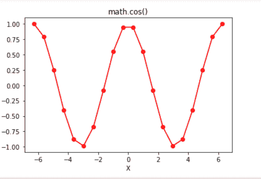

# Python | math.cos()函数

> 原文:[https://www.geeksforgeeks.org/python-math-cos-function/](https://www.geeksforgeeks.org/python-math-cos-function/)

在 Python 中，数学模块包含许多数学运算，使用该模块可以轻松执行这些运算。`**math.cos()**`函数返回作为参数传递的值的余弦值。在此函数中传递的值应该以弧度为单位。

> **语法:** math.cos(x)
> 
> **参数:**
> x:要传递给 cos()的值
> 
> **返回:**返回作为参数传递的值的余弦值

**代码#1:**

```py
# Python code to demonstrate the working of cos()

# importing "math" for mathematical operations 
import math 

a = math.pi / 6

# returning the value of cosine of pi / 6 
print ("The value of cosine of pi / 6 is : ", end ="") 
print (math.cos(a)) 
```

**Output:**

```py
The value of cosine of pi/6 is : 0.8660254037844387

```

**代码#2:**

```py
# Python program showing 
# Graphical representation of 
# cos() function 
import math
import numpy as np
import matplotlib.pyplot as plt 

in_array = np.linspace(-(2 * np.pi), 2 * np.pi, 20)

out_array = []

for i in range(len(in_array)):
    out_array.append(math.cos(in_array[i]))
    i += 1

print("in_array : ", in_array) 
print("\nout_array : ", out_array) 

# red for numpy.sin() 
plt.plot(in_array, out_array, color = 'red', marker = "o") 
plt.title("math.cos()") 
plt.xlabel("X") 
plt.ylabel("Y") 
plt.show() 
```

**Output:**

> in _ array:【-6.28318531-5.62179738-4.96040945-4.29902153-3.6376336-2.97624567】
> -2.31485774-1.65346982-0.99208189-0.3339995
> 
> out_array : [1.0，0.7891405093963934，0.2454854871407988，-0.40169542465296987，-0.8794737512064891，-0.986361303402723，-0.67728151625712，-0.0000。

