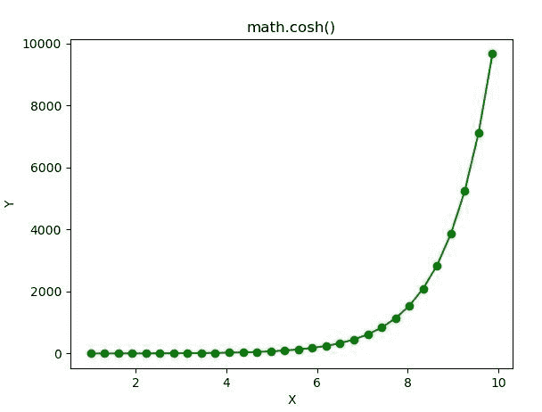

# Python–math . cosh()函数

> 原文:[https://www.geeksforgeeks.org/python-math-cosh-function/](https://www.geeksforgeeks.org/python-math-cosh-function/)

**数学模块**包含许多用于数学运算的函数。函数的作用是:返回一个数字的双曲余弦值。

> **语法:** math.cosh(x)
> 
> **参数:**此方法只接受单个参数。
> 
> *   **x :** 此参数是要传递给 cosh()的值
> 
> **返回:**这个函数返回一个数的双曲余弦值。

下面的例子说明了上述功能的使用:

**例 1:**

```
# Python code to implement
# the cosh()function

# importing "math"
# for mathematical operations  
import math  

a = math.pi / 6

# Return the hyperbolic cosine value of numbers 
print (math.cosh(7))
print (math.cosh(56))
print (math.cosh(2.45))
print (math.cosh(1))
```

**输出:**

```
548.3170351552121
1.045829748006498e+24
5.8373201528613805
1.5430806348152437

```

**例 2:**

```
# Python code implementation of 
# the cosh() function
import math 
import numpy as np 
import matplotlib.pyplot as plt  

in_array = np.linspace(1, np.pi**2, 30) 

out_array = [] 

for i in range(len(in_array)): 
    out_array.append(math.cosh(in_array[i])) 
    i += 1

print("Input_Array : \n", in_array)  
print("\nOutput_Array : \n", out_array)  

plt.plot(in_array, out_array, "go-")  
plt.title("math.cosh()")  
plt.xlabel("X")  
plt.ylabel("Y")  
plt.show() 
```

**输出:**

```
Input_Array : 
 [1\.         1.30584843 1.61169686 1.91754528 2.22339371 2.52924214
 2.83509057 3.14093899 3.44678742 3.75263585 4.05848428 4.3643327
 4.67018113 4.97602956 5.28187799 5.58772641 5.89357484 6.19942327
 6.5052717  6.81112012 7.11696855 7.42281698 7.72866541 8.03451384
 8.34036226 8.64621069 8.95205912 9.25790755 9.56375597 9.8696044 ]

Output_Array : 
 [1.5430806348152437, 1.9808808604882286, 2.6054281010353004, 3.475601381008832, 
4.673436054326172, 6.311857665383541, 8.545327974639738, 11.584406799892538, 
15.715602486950852, 21.328382407531667, 28.951889891868053, 39.30482907505833, 
53.36322053774325, 72.45241538606689, 98.37204237377239, 133.56566742304807, 
181.35116015020702, 246.23348513897733, 334.32940627527836, 453.94414303138643, 
616.3543428169035, 836.8711839061114, 1136.2838326866956, 1542.8193367770289, 
2094.8037224129744, 2844.275170350752, 3861.889901480525, 5243.583273208655, 
7119.614059693799, 9666.84456304416]

```

