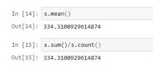
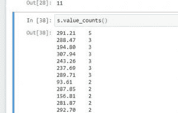
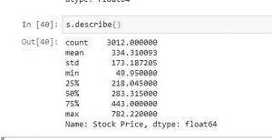

# 数据分析的 Python |数学运算

> 原文:[https://www . geesforgeks . org/python-math-operations-for-data-analysis/](https://www.geeksforgeeks.org/python-math-operations-for-data-analysis/)

Python 是进行数据分析的优秀语言，主要是因为以数据为中心的 Python 包的奇妙生态系统。 ***【熊猫】*** 就是其中一个包，让导入和分析数据变得容易多了。
有一些重要的数学运算可以在熊猫系列上执行，以简化使用 Python 的数据分析并节省大量时间。

要获取所用的数据集，请单击此处的。

```
s=read_csv("stock.csv", squeeze=True)
#reading csv file and making series
```

<figure class="table">

| 功能 | 使用 |
| --- | --- |
| **s.sum()** | 返回序列中所有值的总和 |
| **s.mean()** | 返回序列中所有值的平均值。等于 s.sum()/s.count()

 |
| **s.std()** | 返回所有值的标准偏差 |
| **s.min()或 s.max()** | 从序列中返回最小值和最大值 |
| **s.idxmin()或 s.idxmax()** | 返回序列中最小值或最大值的索引 |
| **中位数()** | 返回所有值的中值 |
| **s.mode()** | 返回序列的模式 |
| **s.value_counts()** | 返回每个值的频率系列
 |
| **s . description()** | 根据传递的数据类型返回一系列信息，如平均值、模式等


 |

</figure>

**代码#1:**

## 蟒蛇 3

```
# import pandas for reading csv file
import pandas as pd

#reading csv file
s = pd.read_csv("stock.csv", squeeze = True)

#using count function
print(s.count())

#using sum function
print(s.sum())

#using mean function
print(s.mean())

#calculation average
print(s.sum()/s.count())

#using std function
print(s.std())

#using min function
print(s.min())

#using max function
print(s.max())

#using count function
print(s.median())

#using mode function
print(s.mode())
```

**输出:**

```
3012
1006942.0
334.3100929614874
334.3100929614874
173.18720477113115
49.95
782.22
283.315
0    291.21
```

**代码#2:**

## 蟒蛇 3

```
# import pandas for reading csv file
import pandas as pd

#reading csv file
s = pd.read_csv("stock.csv", squeeze = True)

#using describe function
print(s.describe())

#using count function
print(s.idxmax())

#using idxmin function
print(s.idxmin())

#count of elements having value 3
print(s.value_counts().head(3))
```

**输出:**

```
dtype: float64
count    3012.000000
mean      334.310093
std       173.187205
min        49.950000
25%       218.045000
50%       283.315000
75%       443.000000
max       782.220000
Name: Stock Price, dtype: float64

3011
11
291.21    5
288.47    3
194.80    3
Name: Stock Price, dtype: int64
```

**意外输出和限制:**

1.  。sum()，。均值()，。mode()，。中值()和其他此类数学运算不适用于字符串或除数值之外的任何其他数据类型。
2.  。字符串序列上的 sum()会给出意外的输出，并通过串联每个字符串来返回一个字符串。