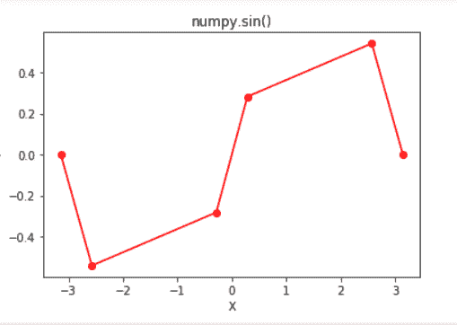

# Python | math.sin()函数

> 原文:[https://www.geeksforgeeks.org/python-math-sin-function/](https://www.geeksforgeeks.org/python-math-sin-function/)

在 Python 中，数学模块包含许多数学运算，使用该模块可以轻松执行这些运算。`**math.sin()**`函数返回作为参数传递的值的正弦值。在此函数中传递的值应该以弧度为单位。

> **语法:** math.sin(x)
> 
> **参数:**
> x:要传递给 sin 的值()
> 
> **返回:**返回作为参数传递的值的正弦值

**代码#1:**

```py
# Python code to demonstrate the working of sin()

# importing "math" for mathematical operations 
import math 

a = math.pi / 6

# returning the value of sine of pi / 6 
print ("The value of sine of pi / 6 is : ", end ="") 
print (math.sin(a)) 
```

**Output:**

```py
The value of sine of pi/6 is : 0.49999999999999994

```

**代码#2:**

```py
# Python program showing 
# Graphical representation of 
# sin() function 
import math
import matplotlib.pyplot as plt 

in_array = [-3.14159265, -2.57039399, -0.28559933,
            0.28559933, 2.57039399,  3.14159265]

out_array = []

for i in range(len(in_array)):
    out_array.append(math.sin(in_array[i]))
    i += 1

print("in_array : ", in_array) 
print("\nout_array : ", out_array) 

# red for numpy.sin() 
plt.plot(in_array, out_array, color = 'red', marker = "o") 
plt.title("math.sin()") 
plt.xlabel("X") 
plt.ylabel("Y") 
plt.show() 
```

**Output:**

> in_array : [-3.14159265，-2.57039399，-0.28559933，0.28559933，2.57039399，3.14159265]
> 
> out _ array:[-3.5897930298416118 e-09，-0.5406408168673427，-0.2817325547837714，0.28173254783714，0.54068168673.27，3.540681686

