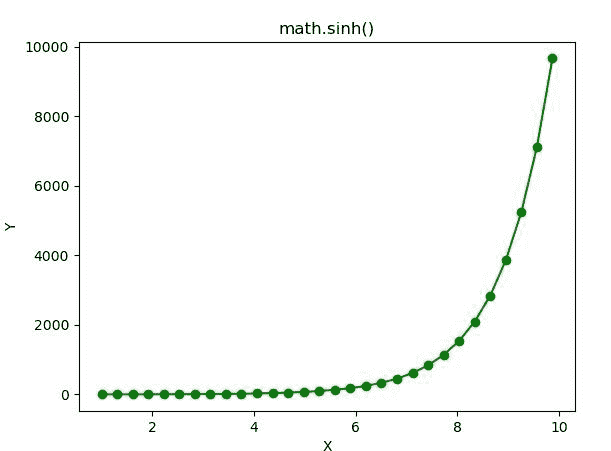

# Python–math . sinh()函数

> 原文:[https://www.geeksforgeeks.org/python-math-sinh-function/](https://www.geeksforgeeks.org/python-math-sinh-function/)

**数学模块**包含许多用于数学运算的函数。函数的作用是:返回一个数字的双曲正弦值。

> **语法:** math.sinh(x)
> 
> **参数:**此方法只接受单个参数。
> 
> *   **x :** 此参数是要传递给 sinh()的值
> 
> **返回:**这个函数返回一个数字的双曲正弦值。

下面的例子说明了上述功能的使用:

**例 1:**

```py
# Python code to implement
# the sinh()function

# importing "math"
# for mathematical operations  
import math  

a = math.pi / 6

# Return the hyperbolic cosine value of numbers 
print (math.sinh(7))
print (math.sinh(56))
print (math.sinh(2.45))
print (math.sinh(1))
```

**输出:**

```py
548.3161232732465
1.045829748006498e+24
5.75102656636201
1.1752011936438014

```

**例 2:**

```py
# Python code implementation of 
# the sinh() function
import math 
import numpy as np 
import matplotlib.pyplot as plt  

in_array = np.linspace(1, np.pi**2, 30) 

out_array = [] 

for i in range(len(in_array)): 
    out_array.append(math.sinh(in_array[i])) 
    i += 1

print("Input_Array : \n", in_array)  
print("\nOutput_Array : \n", out_array)  

plt.plot(in_array, out_array, "go-")  
plt.title("math.sinh()")  
plt.xlabel("X")  
plt.ylabel("Y")  
plt.show() 
```

**输出:**

```py
Input_Array : 
 [1\.         1.30584843 1.61169686 1.91754528 2.22339371 2.52924214
 2.83509057 3.14093899 3.44678742 3.75263585 4.05848428 4.3643327
 4.67018113 4.97602956 5.28187799 5.58772641 5.89357484 6.19942327
 6.5052717  6.81112012 7.11696855 7.42281698 7.72866541 8.03451384
 8.34036226 8.64621069 8.95205912 9.25790755 9.56375597 9.8696044 ]

Output_Array : 
 [1.1752011936438014, 1.7099382981407796, 2.405879379699741, 3.32863409819561, 4.5651949086403505, 
6.232138251680635, 8.486614766451963, 11.541164625175245, 15.683754701214113, 21.304926569268112, 
28.934614708180437, 39.292105932611335, 53.35384996567561, 72.44551397619581, 98.36695949752269, 
133.56192389361678, 181.3484030473553, 246.2314545375691, 334.3279107409074, 453.9430415729487, 616.3535315946984, 
836.8705864423821, 1136.2833926557084, 1542.8190126949794, 2094.803483727114, 2844.2749945590353, 
3861.8897720102345, 5243.583177854012, 7119.613989465273, 9666.844511320973]

```

