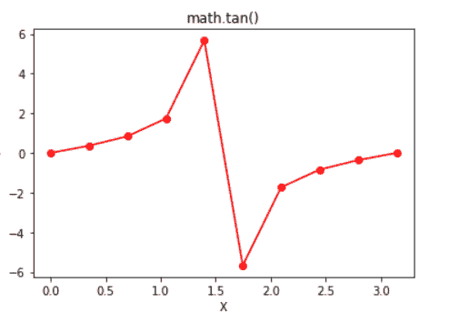

# Python | math.tan()函数

> 原文:[https://www.geeksforgeeks.org/python-math-tan-function/](https://www.geeksforgeeks.org/python-math-tan-function/)

在 Python 中，数学模块包含许多数学运算，使用该模块可以轻松执行这些运算。`**math.tan()**`函数返回作为参数传递的值的正切值。在此函数中传递的值应该以弧度为单位。

> **语法:** math.tan(x)
> 
> **参数:**
> x:要传递给 tan()的值
> 
> **返回:**返回作为参数传递的值的正切值

**代码#1:**

```
# Python code to demonstrate the working of tan()

# importing "math" for mathematical operations 
import math 

a = math.pi / 6

# returning the value of tangent of pi / 6 
print ("The value of tangent of pi / 6 is : ", end ="") 
print (math.tan(a)) 
```

**代码#2:**

```
# Python program showing 
# Graphical representation of 
# tan() function 
import math
import numpy as np
import matplotlib.pyplot as plt 

in_array = np.linspace(0, np.pi, 10) 

out_array = []

for i in range(len(in_array)):
    out_array.append(math.tan(in_array[i]))
    i += 1

print("in_array : ", in_array) 
print("\nout_array : ", out_array) 

# red for numpy.sin() 
plt.plot(in_array, out_array, color = 'red', marker = "o") 
plt.title("math.tan()") 
plt.xlabel("X") 
plt.ylabel("Y") 
plt.show() 
```

**Output:**

> in_array : [0。0.34906585 0.6981317 1.04719755 1.3962634 1.74532925
> 2.0943951 2.44346095 2.7925268 3.14159265】
> 
> out_array : [0.0，0.36397023426620234，0.8390996311772799，1.7320508075688767，5.6712819617707，-5.67128181961711，-1.7320508783，-0.8308888883

