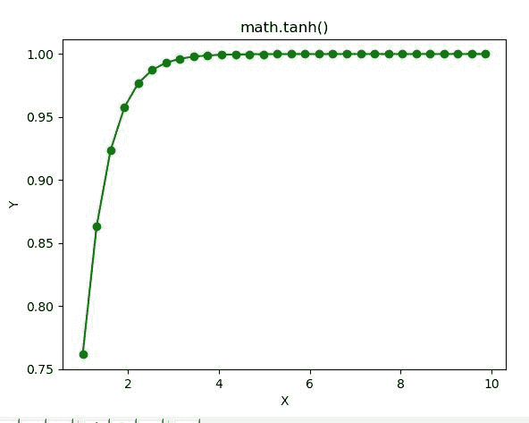

# Python–math . tanh()函数

> 原文:[https://www.geeksforgeeks.org/python-math-tanh-function/](https://www.geeksforgeeks.org/python-math-tanh-function/)

**数学模块**包含许多用于数学运算的函数。函数的作用是:返回一个数字的双曲正切值。

> **语法:** math.tanh(x)
> 
> **参数:**此方法只接受单个参数。
> 
> *   **x :** 此参数是要传递给 tanh()的值
> 
> **返回:**这个函数返回一个数的双曲正切值。

下面的例子说明了上述功能的使用:

**例 1:**

```py
# Python code to implement
# the tanh()function

# importing "math"
# for mathematical operations  
import math  

a = math.pi / 6

# Return the hyperbolic cosine value of numbers 
print (math.tanh(7))
print (math.tanh(56))
print (math.tanh(2.45))
print (math.tanh(1))
```

**输出:**

```py
0.9999983369439447
1.0
0.985216917311436
0.7615941559557649

```

**例 2:**

```py
# Python code implementation of 
# the tanh() function
import math 
import numpy as np 
import matplotlib.pyplot as plt  

in_array = np.linspace(1, np.pi**2, 30) 

out_array = [] 

for i in range(len(in_array)): 
    out_array.append(math.tanh(in_array[i])) 
    i += 1

print("Input_Array : \n", in_array)  
print("\nOutput_Array : \n", out_array)  

plt.plot(in_array, out_array, "go-")  
plt.title("math.tanh()")  
plt.xlabel("X")  
plt.ylabel("Y")  
plt.show() 
```

**输出:**

```py
Input_Array : 
 [1\.         1.30584843 1.61169686 1.91754528 2.22339371 2.52924214
 2.83509057 3.14093899 3.44678742 3.75263585 4.05848428 4.3643327
 4.67018113 4.97602956 5.28187799 5.58772641 5.89357484 6.19942327
 6.5052717  6.81112012 7.11696855 7.42281698 7.72866541 8.03451384
 8.34036226 8.64621069 8.95205912 9.25790755 9.56375597 9.8696044 ]

Output_Array : 
 [0.7615941559557649, 0.8632211720796424, 0.9234103903092679, 0.9577145746297974, 0.976839065640874, 
0.9873698967991443, 0.9931292036581836, 0.9962672085447057, 0.9979734925362752, 0.9989002523578501, 
0.9994033141272595, 0.9996762956932671, 0.9998244001772529, 0.9999047456204971, 0.9999483300729858, 
0.999971972367574, 0.9999847968832987, 0.9999917533498457, 0.9999955267638955, 0.9999975735815636, 
0.9999986838379343, 0.9999992860744392, 0.9999996127455353, 0.9999997899416726, 0.9999998860581267, 
0.9999999381945465, 0.9999999664748882, 0.9999999818149847, 0.9999999901359082, 0.999999994649424]

```

