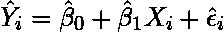
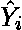
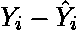
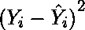
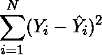
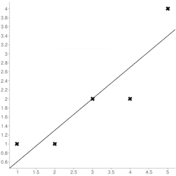

# Python |均方误差

> 原文:[https://www.geeksforgeeks.org/python-mean-squared-error/](https://www.geeksforgeeks.org/python-mean-squared-error/)

估计器的 [**【均方误差】**](https://en.wikipedia.org/wiki/Mean_squared_error) 或**均方偏差(MSD)** 测量误差平方的平均值，即估计值和真实值之间的平均平方差。这是一个风险函数，对应于平方误差损失的期望值。它总是非负的，接近零的值更好。均方误差是误差的第二个矩(关于原点)，因此包含了估计量的方差及其偏差。

**寻找最小均方误差的步骤**

1.  Find the equation for the regression line.

    (1) 

2.  Insert X values in the equation found in step 1 in order to get the respective Y values i.e.

    (2) 

3.  Now subtract the new Y values (i.e. ) from the original Y values. Thus, found values are the error terms. It is also known as the vertical distance of the given point from the regression line.

    (3) 

4.  Square the errors found in step 3.

    (4) 

5.  Sum up all the squares.

    (5) 

6.  Divide the value found in step 5 by the total number of observations.

    (6) 

**例:**
考虑给定的数据点:(1，1)、(2，1)、(3，2)、(4，2)、(5，4)
可以用[这个在线计算器](http://www.alcula.com/calculators/statistics/linear-regression/)来求回归方程/线。



**回归线方程:Y = 0.7X–0.1**

| X | Y |  |
| --- | --- | --- |
| one | one | Zero point six |
| Two | one | One point two nine |
| three | Two | One point nine nine |
| four | Two | Two point six nine |
| five | four | Three point four |

现在，使用上面步骤 6 中为 **MSE** 找到的公式，我们可以得到 **MSE = 0.21606**

**使用 scikit 的 MSE–学习:**

```py
from sklearn.metrics import mean_squared_error

# Given values
Y_true = [1,1,2,2,4]  # Y_true = Y (original values)

# calculated values
Y_pred = [0.6,1.29,1.99,2.69,3.4]  # Y_pred = Y'

# Calculation of Mean Squared Error (MSE)
mean_squared_error(Y_true,Y_pred)
```

```py
Output: 0.21606
```

**使用 Numpy 模块的 MSE:**

```py
import numpy as np

# Given values
Y_true = [1,1,2,2,4]  # Y_true = Y (original values)

# Calculated values
Y_pred = [0.6,1.29,1.99,2.69,3.4]  # Y_pred = Y'

# Mean Squared Error
MSE = np.square(np.subtract(Y_true,Y_pred)).mean()
```

```py
Output: 0.21606
```