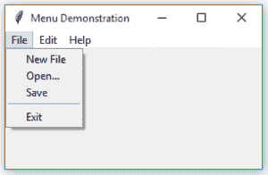
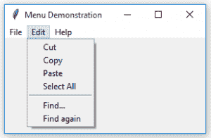
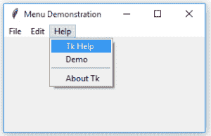

# python | tkinter

中的菜单小部件

> 原文:[https://www . geesforgeks . org/python-menu-widget-in-tkinter/](https://www.geeksforgeeks.org/python-menu-widget-in-tkinter/)

[Tkinter](https://www.geeksforgeeks.org/python-gui-tkinter/) 是 Python 的标准 GUI(图形用户界面)包。它是 Python 本身附带的图形用户界面应用程序最常用的包之一。

**菜单**是任何 GUI 的重要组成部分。菜单的一个常见用途是提供对各种操作的便捷访问，如保存或打开文件、退出程序或操作数据。顶层菜单显示在根窗口或任何其他顶层窗口的标题栏下。

```
menu = Menu(master, **options)
```

下面是实现:

```
# importing only  those functions 
# which are needed
from tkinter import * 
from tkinter.ttk import * 
from time import strftime

# creating tkinter window
root = Tk()
root.title('Menu Demonstration')

# Creating Menubar
menubar = Menu(root)

# Adding File Menu and commands
file = Menu(menubar, tearoff = 0)
menubar.add_cascade(label ='File', menu = file)
file.add_command(label ='New File', command = None)
file.add_command(label ='Open...', command = None)
file.add_command(label ='Save', command = None)
file.add_separator()
file.add_command(label ='Exit', command = root.destroy)

# Adding Edit Menu and commands
edit = Menu(menubar, tearoff = 0)
menubar.add_cascade(label ='Edit', menu = edit)
edit.add_command(label ='Cut', command = None)
edit.add_command(label ='Copy', command = None)
edit.add_command(label ='Paste', command = None)
edit.add_command(label ='Select All', command = None)
edit.add_separator()
edit.add_command(label ='Find...', command = None)
edit.add_command(label ='Find again', command = None)

# Adding Help Menu
help_ = Menu(menubar, tearoff = 0)
menubar.add_cascade(label ='Help', menu = help_)
help_.add_command(label ='Tk Help', command = None)
help_.add_command(label ='Demo', command = None)
help_.add_separator()
help_.add_command(label ='About Tk', command = None)

# display Menu
root.config(menu = menubar)
mainloop()
```

**输出:**




**注意:**在上述应用中，命令被设置为无，但是可以向不同的标签添加不同的命令来执行所需的任务。