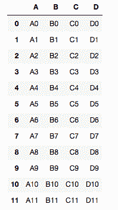
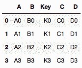
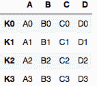

# Python |使用 Panda

合并、连接和连接数据帧

> 原文:[https://www . geesforgeks . org/python-merge-join-and-concatenate-data frames-use-panda/](https://www.geeksforgeeks.org/python-merge-join-and-concatenate-dataframes-using-panda/)

数据帧是具有多行多列的二维数据结构。在数据框中，数据仅以行和列的形式对齐。数据帧可以执行算术和条件运算。它的大小可变。

下面是使用 [Numpy](https://www.geeksforgeeks.org/numpy-in-python-set-1-introduction/) 和[熊猫](https://www.geeksforgeeks.org/data-analysis-visualization-python/)的实现。

**所需模块:**

```
import numpy as np
import pandas as pd

```

**Code #1 :** DataFrames Concatenation**`concat()`** function does all of the heavy lifting of performing concatenation operations along an axis while performing optional set logic (union or intersection) of the indexes (if any) on the other axes.

```
# Python program to concatenate
# dataframes using Panda

# Creating first dataframe
df1 = pd.DataFrame({'A': ['A0', 'A1', 'A2', 'A3'],
                    'B': ['B0', 'B1', 'B2', 'B3'],
                    'C': ['C0', 'C1', 'C2', 'C3'],
                    'D': ['D0', 'D1', 'D2', 'D3']},
                    index = [0, 1, 2, 3])

# Creating second dataframe
df2 = pd.DataFrame({'A': ['A4', 'A5', 'A6', 'A7'],
                    'B': ['B4', 'B5', 'B6', 'B7'],
                    'C': ['C4', 'C5', 'C6', 'C7'],
                    'D': ['D4', 'D5', 'D6', 'D7']},
                    index = [4, 5, 6, 7])

# Creating third dataframe
df3 = pd.DataFrame({'A': ['A8', 'A9', 'A10', 'A11'],
                    'B': ['B8', 'B9', 'B10', 'B11'],
                    'C': ['C8', 'C9', 'C10', 'C11'],
                    'D': ['D8', 'D9', 'D10', 'D11']},
                    index = [8, 9, 10, 11])

# Concatenating the dataframes
pd.concat([df1, df2, df3])
```

**输出:**

<center></center>

**代码#2 :** 数据帧合并
Pandas 提供了一个函数 Merge()，作为数据帧对象之间所有标准数据库连接操作的入口点。

```
# Python program to merge
# dataframes using Panda

# Dataframe created
left = pd.DataFrame({'Key': ['K0', 'K1', 'K2', 'K3'],
                    'A': ['A0', 'A1', 'A2', 'A3'],
                    'B': ['B0', 'B1', 'B2', 'B3']})

right = pd.DataFrame({'Key': ['K0', 'K1', 'K2', 'K3'],
                      'C': ['C0', 'C1', 'C2', 'C3'],
                      'D': ['D0', 'D1', 'D2', 'D3']})

# Merging the dataframes                      
pd.merge(left, right, how ='inner', on ='Key')
```

**输出:**

<center></center>

**代码#3 :** 数据框连接

```
# Python program to join
# dataframes using Panda

left = pd.DataFrame({'A': ['A0', 'A1', 'A2', 'A3'],
                    'B': ['B0', 'B1', 'B2', 'B3']},
                    index = ['K0', 'K1', 'K2', 'K3'])

right = pd.DataFrame({'C': ['C0', 'C1', 'C2', 'C3'],
                      'D': ['D0', 'D1', 'D2', 'D3']},
                      index = ['K0', 'K1', 'K2', 'K3'])

# Joining the dataframes                      
left.join(right)
```

**输出:**

<center></center>