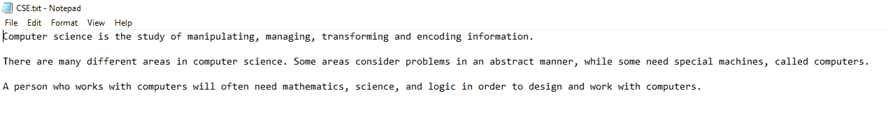
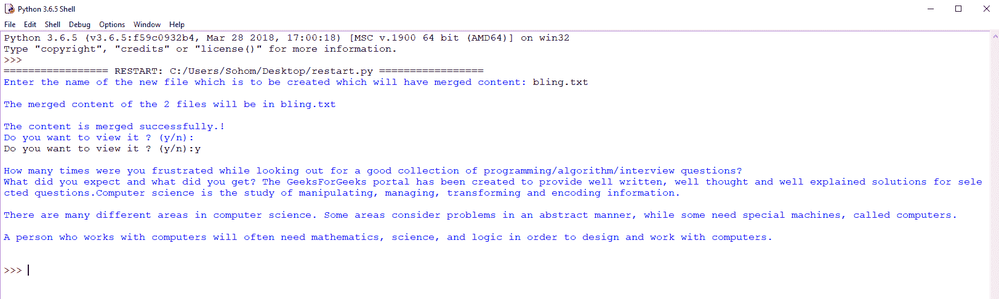
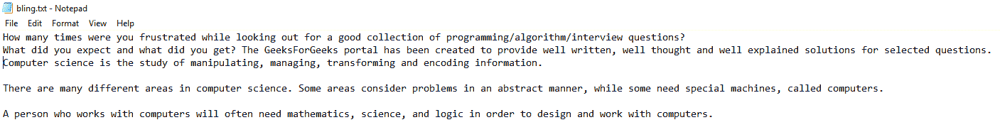

# Python |合并两个文本文件

> 原文:[https://www.geeksforgeeks.org/python-merge-two-text-files/](https://www.geeksforgeeks.org/python-merge-two-text-files/)

给定两个文本文件，任务是合并数据并存储在一个新的文本文件中。让我们看看如何使用 Python 来完成这个任务。

要在 Python 中合并两个文件，我们要求用户输入主文件和第二个文件的名称，并创建一个新文件，将这两个数据的统一内容放入这个新创建的文件中。

为了完成这个任务，我们必须导入`shutil` & `pathlib`库。您可以使用以下命令安装库–

```py
pip install shutil
pip install pathlib
```

另外，将这两个文本文件放在桌面上。

**第一个文本文件:**


**第二个文本文件:**


下面是 Python 实现–

```py
import shutil
from pathlib import Path

firstfile = Path(r'C:\Users\Sohom\Desktop\GFG.txt')
secondfile = Path(r'C:\Users\Sohom\Desktop\CSE.txt')

newfile = input("Enter the name of the new file: ")
print()
print("The merged content of the 2 files will be in", newfile)

with open(newfile, "wb") as wfd:

    for f in [firstfile, secondfile]:
        with open(f, "rb") as fd:
            shutil.copyfileobj(fd, wfd, 1024 * 1024 * 10)

print("\nThe content is merged successfully.!")
print("Do you want to view it ? (y / n): ")

check = input()
if check == 'n':
    exit()
else:
    print()
    c = open(newfile, "r")
    print(c.read())
    c.close()
```

**输出:**


**更新后的合并文本文件:**
