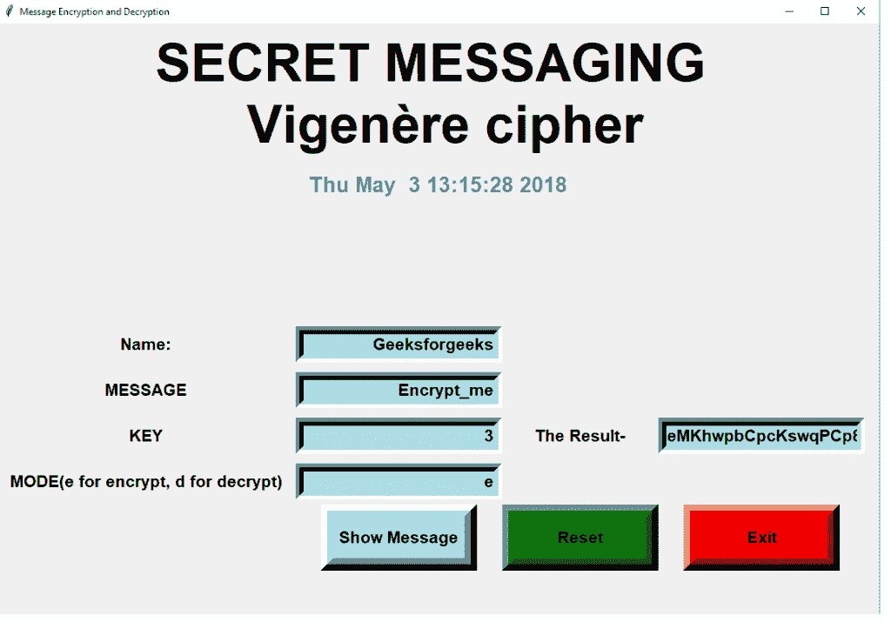
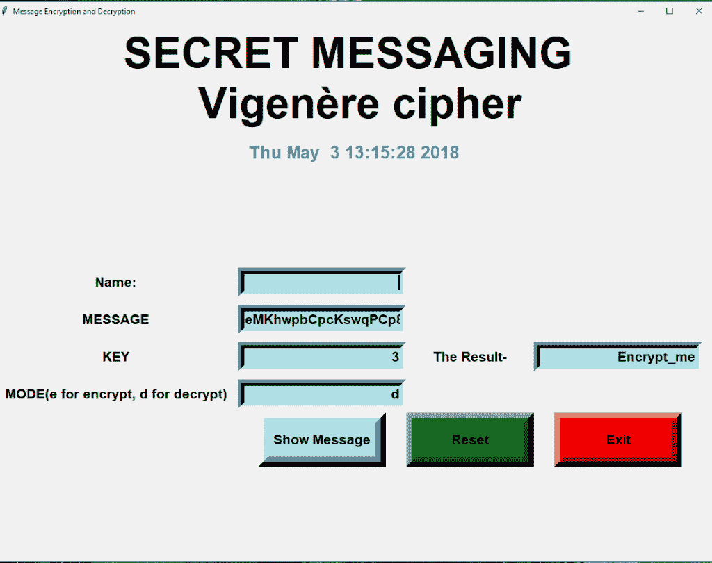

# Python |使用 Tkinter 进行消息编码-解码

> 原文:[https://www . geesforgeks . org/python-message-encode-decode-using-tkinter/](https://www.geeksforgeeks.org/python-message-encode-decode-using-tkinter/)

先决条件:[Tkinter 的基础知识](https://www.geeksforgeeks.org/python-gui-tkinter/)
Python 为开发 GUI(图形用户界面)提供了多个选项。在所有的 GUI 方法中，tkinter 是最常用的方法。它是 Python 附带的 Tk 图形用户界面工具包的标准 Python 接口。带有 tkinter 输出的 Python 是创建图形用户界面应用程序最快最简单的方法。
Python 提供了开发 GUI 应用的 Tkinter 工具包。现在，取决于开发人员的想象力或必要性，他/她想使用这个工具包开发什么。让我们尝试根据 Vigenère 密码实现一个消息加密-解密应用程序，它可以使用密钥对消息进行加密，也可以使用相同的密钥对加密的哈希进行解密。

```py
Modules used in the project :

Tkinter  -> GUI toolkittime datetime  base64   -> Vigenère cipher
```

以下是上述思路的实现:

## 蟒蛇 3

```py
# import tkinter module
from tkinter import *

# import other necessary modules
import random
import time
import datetime

# creating root object
root = Tk()

# defining size of window
root.geometry("1200x6000")

# setting up the title of window
root.title("Message Encryption and Decryption")

Tops = Frame(root, width = 1600, relief = SUNKEN)
Tops.pack(side = TOP)

f1 = Frame(root, width = 800, height = 700,
                            relief = SUNKEN)
f1.pack(side = LEFT)

# ==============================================
#                  TIME
# ==============================================
localtime = time.asctime(time.localtime(time.time()))

lblInfo = Label(Tops, font = ('helvetica', 50, 'bold'),
          text = "SECRET MESSAGING \n Vigenère cipher",
                     fg = "Black", bd = 10, anchor='w')

lblInfo.grid(row = 0, column = 0)

lblInfo = Label(Tops, font=('arial', 20, 'bold'),
             text = localtime, fg = "Steel Blue",
                           bd = 10, anchor = 'w')

lblInfo.grid(row = 1, column = 0)

rand = StringVar()
Msg = StringVar()
key = StringVar()
mode = StringVar()
Result = StringVar()

# exit function
def qExit():
    root.destroy()

# Function to reset the window
def Reset():
    rand.set("")
    Msg.set("")
    key.set("")
    mode.set("")
    Result.set("")

# reference
lblReference = Label(f1, font = ('arial', 16, 'bold'),
                text = "Name:", bd = 16, anchor = "w")

lblReference.grid(row = 0, column = 0)

txtReference = Entry(f1, font = ('arial', 16, 'bold'),
               textvariable = rand, bd = 10, insertwidth = 4,
                        bg = "powder blue", justify = 'right')

txtReference.grid(row = 0, column = 1)

# labels
lblMsg = Label(f1, font = ('arial', 16, 'bold'),
         text = "MESSAGE", bd = 16, anchor = "w")

lblMsg.grid(row = 1, column = 0)

txtMsg = Entry(f1, font = ('arial', 16, 'bold'),
         textvariable = Msg, bd = 10, insertwidth = 4,
                bg = "powder blue", justify = 'right')

txtMsg.grid(row = 1, column = 1)

lblkey = Label(f1, font = ('arial', 16, 'bold'),
            text = "KEY", bd = 16, anchor = "w")

lblkey.grid(row = 2, column = 0)

txtkey = Entry(f1, font = ('arial', 16, 'bold'),
         textvariable = key, bd = 10, insertwidth = 4,
                bg = "powder blue", justify = 'right')

txtkey.grid(row = 2, column = 1)

lblmode = Label(f1, font = ('arial', 16, 'bold'),
          text = "MODE(e for encrypt, d for decrypt)",
                                bd = 16, anchor = "w")

lblmode.grid(row = 3, column = 0)

txtmode = Entry(f1, font = ('arial', 16, 'bold'),
          textvariable = mode, bd = 10, insertwidth = 4,
                  bg = "powder blue", justify = 'right')

txtmode.grid(row = 3, column = 1)

lblService = Label(f1, font = ('arial', 16, 'bold'),
             text = "The Result-", bd = 16, anchor = "w")

lblService.grid(row = 2, column = 2)

txtService = Entry(f1, font = ('arial', 16, 'bold'),
             textvariable = Result, bd = 10, insertwidth = 4,
                       bg = "powder blue", justify = 'right')

txtService.grid(row = 2, column = 3)

# Vigenère cipher
import base64

# Function to encode
def encode(key, clear):
    enc = []

    for i in range(len(clear)):
        key_c = key[i % len(key)]
        enc_c = chr((ord(clear[i]) +
                     ord(key_c)) % 256)

        enc.append(enc_c)

    return base64.urlsafe_b64encode("".join(enc).encode()).decode()

# Function to decode
def decode(key, enc):
    dec = []

    enc = base64.urlsafe_b64decode(enc).decode()
    for i in range(len(enc)):
        key_c = key[i % len(key)]
        dec_c = chr((256 + ord(enc[i]) -
                           ord(key_c)) % 256)

        dec.append(dec_c)
    return "".join(dec)

def Ref():
    print("Message= ", (Msg.get()))

    clear = Msg.get()
    k = key.get()
    m = mode.get()

    if (m == 'e'):
        Result.set(encode(k, clear))
    else:
        Result.set(decode(k, clear))

# Show message button
btnTotal = Button(f1, padx = 16, pady = 8, bd = 16, fg = "black",
                        font = ('arial', 16, 'bold'), width = 10,
                       text = "Show Message", bg = "powder blue",
                         command = Ref).grid(row = 7, column = 1)

# Reset button
btnReset = Button(f1, padx = 16, pady = 8, bd = 16,
                  fg = "black", font = ('arial', 16, 'bold'),
                    width = 10, text = "Reset", bg = "green",
                   command = Reset).grid(row = 7, column = 2)

# Exit button
btnExit = Button(f1, padx = 16, pady = 8, bd = 16,
                 fg = "black", font = ('arial', 16, 'bold'),
                      width = 10, text = "Exit", bg = "red",
                  command = qExit).grid(row = 7, column = 3)

# keeps window alive
root.mainloop()
```

**输出:**
加密窗口–



解密窗口–

