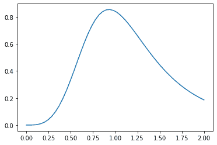

# 统计中的 Python–Mielke 分布

> 原文:[https://www . geesforgeks . org/python-mielke-distribution-in-statistics/](https://www.geeksforgeeks.org/python-mielke-distribution-in-statistics/)

**scipy.stats.mielke()** 是 Mielke Beta-Kappa / Dagum 连续随机变量。它继承自泛型方法的，作为 **rv_continuous 类**的实例。它用特定于这个特定分布的细节来完成这些方法。

**参数:**

> **q :** 上下尾概率
> T3】x:分位数
> **loc :** 【可选】位置参数。默认= 0
> **比例:**【可选】比例参数。默认值= 1
> **大小:**【整数元组，可选】形状或随机变量。
> **时刻:**【可选】由字母['mvsk']组成；m’=均值，‘v’=方差，‘s’= Fisher 偏斜度，‘k’= Fisher 峰度。(默认值= 'mv ')。
> 
> **结果:**米尔克连续随机变量

**代码#1:创建米克连续随机变量**

```py
# importing library

from scipy.stats import mielke  

numargs = mielke.numargs 
a, b = 4.32, 3.18
rv = mielke(a, b) 

print ("RV : \n", rv)  
```

**输出:**

```py
RV : 
 scipy.stats._distn_infrastructure.rv_frozen object at 0x000002A9D6DD04C8

```

 **代码#2:米尔克连续变量和概率分布**

```py
import numpy as np 
quantile = np.arange (0.01, 1, 0.1) 

# Random Variates 
R = mielke.rvs(a, b) 
print ("Random Variates : \n", R) 

# PDF 
R = mielke.pdf(a, b, quantile) 
print ("\nProbability Distribution : \n", R) 
```

**输出:**

```py
Random Variates : 
 0.541154909484041

Probability Distribution : 
 [6.94878143e-96 6.26408333e-09 7.39143540e-05 1.84143774e-03
 8.76316044e-03 2.10584824e-02 3.57237873e-02 4.95347163e-02
 6.04795424e-02 6.78033254e-02]

```

**代码#3:图形表示。**

```py
import numpy as np 
import matplotlib.pyplot as plt 

distribution = np.linspace(0, np.minimum(rv.dist.b, 3)) 
print("Distribution : \n", distribution) 

plot = plt.plot(distribution, rv.pdf(distribution)) 
```

**输出:**
分布:
【0。0.04081633 0.08163265 0.12244898 0.16326531 0.20408163
0.24489796 0.28571429 0.32653061 0.36734694 0.4081627]



**代码#4:变化的位置参数**

```py
import matplotlib.pyplot as plt 
import numpy as np 

x = np.linspace(0, 5, 100) 

# Varying positional arguments 
y1 = mielke .pdf(x, 1, 3) 
y2 = mielke .pdf(x, 1, 4) 
plt.plot(x, y1, "*", x, y2, "r--") 
```

**输出:**

