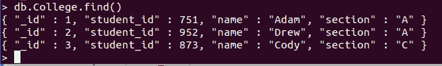

# Python MongoDB–创建 _ 索引查询

> 原文:[https://www . geesforgeks . org/python-MongoDB-create _ index-query/](https://www.geeksforgeeks.org/python-mongodb-create_index-query/)

[**【MongoDB】**](https://www.geeksforgeeks.org/mongodb-and-python/)**是一个开源的面向文档的数据库。MongoDB 以键值对的形式存储数据，是一个 NoSQL 数据库程序。NoSQL 这个术语的意思是非关系的。**

## **索引**

**索引有助于高效地查询文档。它存储一个特定字段或一组字段的值，这些字段按索引中指定的字段值排序。**

**PyMongo 包含一个函数 **create_index()** 来显式创建索引。默认情况下 **_id** 是文档中存在的唯一索引。这个函数可以接受一个键或一个(键，方向)对列表。**

****语法:****

```
create_index(*keys, session=None, **kwargs)*
```

**我们来看一些例子。**

****例 1:****

****样本数据库:****

****

## **蟒蛇 3**

```
from pymongo import MongoClient 

# creation of MongoClient 
client = MongoClient() 

# Connect with the portnumber and host 
client = MongoClient("mongodb://localhost:27017/") 

# Access database 
mydatabase = client['GFG'] 

# Access collection of the database 
mycollection = mydatabase['College'] 

# Before Creating index
index_list = sorted(list(mycollection.index_information()))
print("Before Creating index")
print(index_list)

# Creating index
mycollection.create_index("student_id", unique = True)

# After Creating index
index_list = sorted(list(mycollection.index_information()))
print("\nAfter Creating index")
print(index_list)
```

****输出:****

```
Before Creating index
['_id_']

After Creating index
['_id_', 'student_id_1'] 
```

1.  **这里，我们使用 create_index()方法创建一个名为 **student_id** 的索引。这导致文档中有两个索引 **_id** 和**学生 _id** 。**
2.  **使用 **index_information()** 方法，我们得到集合中的所有索引，**

****例 2:****

## **蟒蛇 3**

```
from pymongo import MongoClient 

# creation of MongoClient 
client = MongoClient() 

# Connect with the portnumber and host 
client = MongoClient("mongodb://localhost:27017/") 

# Access database 
mydatabase = client['GFG'] 

# Access collection of the database 
mycollection = mydatabase['College'] 

record = {'_id': 4, 
          "student_id": 873,
          "name": "John",
          "section": "A"}

mycollection.insert_one(record)
```

****输出:****

> **replicatekeyeror回溯(最近一次调用最后一次)
> <ipython-input-62-264 f0e 13 db 93>在 <模块>
> **16**记录={“_id”:4、 “学生 _ id插入 _ 一 ( 记录 )**
> 
> **重复密钥错误:E11000 重复密钥错误集合:GFG。学院索引:student_id_1 dup 密钥:{ : 873 }**

**这将引发重复错误，因为已经存在一个具有学生标识 873 的文档，我们正在尝试插入另一个具有相同学生标识的文档。出现此错误是因为我们在字段 student_id 上创建了一个索引，并将其标记为唯一。**