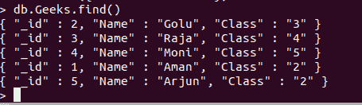
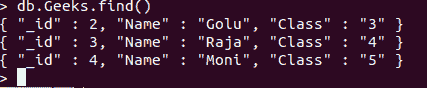

# Python Mongodb–Delete _ multi()

> 原文:[https://www.geeksforgeeks.org/python-mongodb-delete_many/](https://www.geeksforgeeks.org/python-mongodb-delete_many/)

**[【MongoDB】](https://www.geeksforgeeks.org/mongodb-and-python/)**是一个通用的、基于文档的、分布式的数据库，是为现代应用程序开发人员和云构建的。它是一个文档数据库，这意味着它将数据存储在类似 JSON 的文档中。这是一种考虑数据的有效方式，比传统的表模型更具表现力和功能性。

## delete _ multi()

`Delete_many()`用于需要删除多个文档的情况。创建包含要删除的文档的查询对象，并将其作为第一个参数传递给 delete _ multi()。

**样本数据库:**



**示例 1:** 删除名称以“A”开头的所有文档。

```
import pymongo

client = pymongo.MongoClient("mongodb://localhost:27017/")

# Connecting to the database
mydb = client["GFG"]

# Connecting the to collection
col = mydb["Geeks"]

query = {"Name": {"$regex": "^A"}}
d = col.delete_many(query)

print(d.deleted_count, " documents deleted !!")
```

**输出:**

```
2  documents deleted !!

```

**蒙戈布外壳:**



**例 2:**

```
import pymongo

client = pymongo.MongoClient("mongodb://localhost:27017/")

# Connecting to the database
mydb = client["GFG"]

# Connecting the to collection
col = mydb["Geeks"]

query = {"Class": '3'}
d = col.delete_many(query)

print(d.deleted_count, " documents deleted !!")
```

**输出:**

```
1  documents deleted !!

```

**蒙戈布外壳:**

