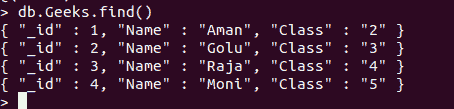
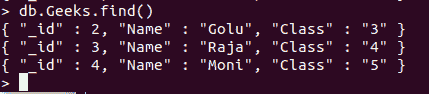

# Python Mongodb–Delete _ one()

> 原文:[https://www.geeksforgeeks.org/python-mongodb-delete_one/](https://www.geeksforgeeks.org/python-mongodb-delete_one/)

[**Mongodb**](https://www.geeksforgeeks.org/mongodb-and-python/) 是一款非常流行的跨平台的面向文档、NoSQL(代表“不仅是 SQL”)的数据库程序，用 C++编写。它以 JSON 格式存储数据(作为键值对)，这使得它易于使用。MongoDB 可以在多台服务器上运行，平衡负载以保持系统在硬件故障的情况下正常运行。

## 连接到数据库

**步骤 1–**建立连接:端口号默认值:27017

```
conn = MongoClient(‘localhost’, port-number)
```

如果使用默认端口号，即 27017。替代连接方法:

```
conn = MongoClient()
```

**步骤 2–**创建数据库或切换到现有数据库:

```
db = conn.dabasename
```

创建集合或切换到现有集合:

```
collection = db.collection_name
```

## 从集合或数据库中删除文档

在 MongoDB 中，可以通过 delete_one()方法删除单个文档。该方法的第一个参数是一个定义要删除的文档的查询对象。如果同一文档再次出现，只有第一个出现的文档会被删除。

**注意:**删除文档和删除 SQL 情况下的记录是一样的。

考虑示例数据库:



**示例:**

## 计算机编程语言

```
# Python program to demonstrate
# delete_one

import pymongo

# creating Mongoclient object to
# create database with the specified
# connection URL
students = pymongo.MongoClient('localhost', 27017)

# connecting to a database with
# name GFG
Db = students["GFG"]

# connecting to a collection with
# name Geeks
coll = Db["Geeks"]

# creating query object
myQuery ={'Class':'2'}
coll.delete_one(myQuery)

# print collection after deletion:
for x in coll.find():
    print(x)
```

**输出:**

```
'_id': 2.0, 'Name': 'Golu', 'Class': '3'}
{'_id': 3.0, 'Name': 'Raja', 'Class': '4'}
{'_id': 4.0, 'Name': 'Moni', 'Class': '5'}
```

**蒙戈布外壳:**

